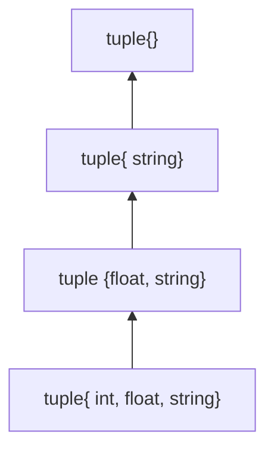

C++11和C++14新特性

<!-- more -->

# C++标准介绍

优秀的c++知识库:[cppreference](https://zh.cppreference.com/w/%E9%A6%96%E9%A1%B5)

C++标准演化

- **C++98(1.0)**    正式版本
- C++03(TR1)
- **C++11(2.0)**   正式版本
- C++14
- C++17
- C++20
- C++23

[编译器对C++11的支持情况](https://zh.cppreference.com/w/cpp/compiler_support/11)

两个层面的新特性

- 语言
  - Variadic Templates
  - move Semantics
  - auto
  - Range-base for loop
  - Initializer list
  - Lambdas
  - ...
- 标准库
  - type_traits
  - unordered_set
  - forward_list
  - array
  - tuple
  - Con-currency
  - regex
  - thread
  - bitset
  - ...

## 确认支持C++标准

程序内部由下面的宏标识C++标准

```cpp
//C++11
#define __cplusplus 201103L
//C++98
#define __cplusplus 199711L
//查询C++标准库
cout<<__cplusplus<<endl;
```

# 可变参数模板

**Variadic Templates**

[[C++基础#模板|基础模板知识点参阅]]

关键词: `...`

`...`就是一个所谓的pack(包)

- 用于模版参数就是模版参数包
- 用于函数参数类型就是函数参数类型包
- 用于函数参数就是函数参数包

## 函数案例

针对下面的情况:

```cpp
void print()
{}

template <typename T,typename... Types>
void print(const T& firstArg,const Types&... args)
{
  cout<<firstArg<<endl;
  print(args...);
}
```

args可以为任意数量(包含0个)的参数,并且每个参数可以是任何类型的(args为一包类型的一包参数)

`sizeof...(args)`用于查看包中的个数

但print函数的参数为0个时,因为0个参数没办法拆分为1+0,所以会走`void print()`,即作为递归的终止条件

## 类案例

> 下面的案例是tuple(元组),tuple可以任意指定多个不同类型的成员,构造出一个对象

```cpp
//下面案例是元组
template<typename... Values> class tuple;//模板的声明，用于告诉编译器有一个名为`tuple`的模板类存在，但具体的实现将在后面的代码中提供

template<> 
class tuple<> {};//作为终止条件的空类

template<typename Head,typename... Tail>
class tuple<Head,Tail...>:private tuple<Tail...>//遍历继承
{
  //定义tuple的继承类型
	typedef tuple<Tail...> inherited;
  public:
  //构造函数
  tuple(){}
  tuple(Head v,Tail... vtail):m_head(v),inherited(vtail...)//初始化列表
  {}
  //定义函数head
  typename Head::type head() {return m_head;}
  //定义函数tail
  inherited& tail() {return *this;}//return后转型为inherited
  protected:
  //定义成员变量m_head
  Head m_head;
};
```

参照如下的继承链理解:(下图使用 `{}` 代替 `<>`)



使用上面案例的情况如下:

```cpp
tuple<int,float,string> t(41,6.3,"nico");
t.head();   //-->获得41
t.tail().head();  //-->获得6.3
t.tail().tail().head();   //-->获得"nico"
```


## 并存问题

```cpp
template <typename T,typename... Types>
void print(const T& firstArg,const Types&... args)

template <typename... Types>
void print(const Types&... args)
```


可变参数模版的作用:1.递归

# C++11中的一些小改动

## 模版表达式中的空格

```cpp
vector<list<int> >;    //每个C++版本的都支持
vecot<list<int>>;    //从C++11开始支持
```

## nullptr

> nullptr是C++11引入的空指针常量用于代替NULL或者0赋值给空指针

例子如下:

```cpp
//有两个函数
void f(int);
void f(void*);
//调用哪个函数?
f(0);				//调用f(int)
f(NULL);    //调用f(int)
f(nullptr); //调用f(void*)
```

### nullptr_t

顾名思义,**nullptr的类型**

`typedef decltype（nullptr）nullptr_t；`

`nullptr_t`是一个与 `nullptr` 具有相同类型的类型。

用处:为了在代码中使用更具有语义的类型,例如:可以使用 `nullptr_t` 来声明接受空指针的函数参数或返回类型，以增加代码的清晰度和可读性。

## auto关键字

**auto**表示任意类型

编译器实际上知道变量是什么类型,他本来就具备对模板的实参推导能力,auto就把编译器这种能力释放出来了

> auto最大的用处是当类型非常长或非常复杂的时候使用

```cpp
//非常长,如:iterator
vector<string> v;
//vector<int>::iterator pos = v.begin();
auto pos=v.begin();

//非常复杂,如:lambda
auto l=[](int x)->bool{
  //...
};
```

## 一致性初始化

Uniform Initialization

**任何变量的初始化都可以用一个共通语法设置初值**: `{}`

```cpp
int values[]{1,2,3};
vector<int>v{2,3,5,7,11,13,17};
//编号1(下面有讲解)
vector<string> cities{
  "Berlin","New York","London","Braunschweig","Cairo","Cologne"
};
//编号2代码(下面有讲解)
complex<double>c{4.0,3.0};
```

其实是利用一个事实:编译器看到{t1,t2...tn}便做出一个`initializer_list<T>`,它关联到一个`array<T,n>`.调用函数(例如ctor(构造函数))时该array内的元素可被编译器分解逐一传给函数.但若函数参数就是个`initializer_list<T>`,调用者不会分解逐一传给函数,而是作为一个`initializer_list<T>`传入

- 编号1代码:这形成一个`initializer_list<string>`,背后有个`array<string,6>`.调用`vector<string> ctors`时编译器找到了一个`vector<string> `接受`initializer_list<string>`的构造函数.**所有stl容器都有这种构造函数**
- 编号2代码:这形成一个这形成一个`initializer_list<double>`,背后有个`array<double,2>`.调用`complex<double> `构造函数时该array内的2个元素被分解传给构造函数.`complex<double>`并无任何构造函数接受`initializer_list<double>`参数

### initializer_list\<T\>

Initializer Lists

初始化列表不填任何东西会被0初始化(若是指针则初始化为nullptr)

```cpp
int i;//i未被初始化
int j{};//j被初始化为0
int* p;//p未被初始化
int* q{};//q初始化为nullptr
```

初始化列表不允许大空间到小空间的转换(narrowing:收缩)

```cpp
int x1(5.3);	//OK			x1=5
int x2 = 5.3;		//OK    x2=5
int x3{5.0};		//ERROR:narrowing
int x4 = {5.3};		//ERROR:narrowing
char cl{7};				//OK 尽管7是int,但没有收缩
char c2{99999};		//ERROR:narrowing
std::vector<int> v1{1,2,4,5};	//OK
std::vector<int> v2{1,2.3,4,5.6};	//ERROR:narrowing
```

上面的ERROR在gcc中是warning

#### 使用

为了支持用户定义类型的初始化列表概念，C++11提供了类模板`std::initializer_list`。它可用于支持通过值列表进行初始化，或者在任何其他只需要处理值列表的地方使用。

```cpp
void print(std::initializer_list<int> vals)
{
  	for(auto p=vals.begin();p!=vals.end();++p){
			std::cout<<*p<<endl;
    }
}
print({12,3,5,7,11,13,17});
//传给initializer_list的,一定必须也是个initializer_list或者{...}形式
```

`如果同时有两个函数P(int a,int b)或者P(initializer_list<int> initlist)`当执行 `P q{77,5};`会优先调用后者

> 对[[STL]]容器的影响:如今**所有容器**都接受指定任意数量的值用于构建或赋值或`insert()`或`assign()`;`max()`和`min()`也可以接受任意参数.
>
> ```cpp
> vector<int> v1{2,5,7,12,34,45,56};
> vector<int> v2({2,5,7,69,83,50});
> vector<int> v3;
> v3 ={2,5,7,13,69,83,50};
> v3.insert(v3.begin()+2,{0,1,2,3,4});
> max({string("Ace"),string("Stacy"),string("Sabrina"),string("Barkley")});
> min({54,16,48,5});
> //要注意的是:
> vector<int>(1)//创建临时的空间大小为1的vector<int>,里面的值是不确定的
> vector<int>{1}//创建临时的空间里面的值是1的vector<int>
> ```

#### initializer_list原理

**initializer_list内部的实现实际上是对array的引用(头指针和长度)**,没有包含array

因此如果复制initializer_list产生的另一个initializer_list,双方是同一个array的引用

## for循环的特殊写法

for的一种语法糖

> 这种语法只适用于支持[[STL#迭代器|迭代器]]访问的容器

```cpp
for(decl:coll)
{
  //statement;
}
//decl:声明
//coll:支持迭代器操作的容器

//其实本质上就是如下代码
for(auto _pos=coll.begin();pos!=coll.end();++_pos){
  decl=* _pos;
	//slatement
}
```

也由于其本质是属于隐式转换

```cpp
class C{
  public:
  explicit C(const string& s);//该构造函数不能隐式类型转换
  //...
};
vector<string> vs;
for(const C& elem: vs){//此处会报错:不存在从sting类型到C类型的转换
  //原因正是因为隐含的decl=* _pos;执行失败
	cout<<elem<<endl;
}
```

for语法糖的其他例子:

```cpp
for (int i : {12, 3, 5, 7, 9, 13, 17, 19})
{
    cout << i << endl;
}
vector<double> vec;
for(auto elem:vec){
  cout<<elem<<endl;
}
//下面的方式才可以真正修改值
for(auto& elem:vec){
  elem*=3;
}
```


# Lambda表达式

[[STL#函数对象（难点）|函数对象详解跳转]]

C++11中的Lambda表达式**用于定义并创建匿名的 [[STL#函数对象（难点）|函数对象]]**，以简化编程工作。首先看一下Lambda表达式的基本构成：

```cpp
[capture](parameters) mutable ->return-type
{
	statement
}
```

`[函数对象参数](操作符重载函数参数)mutable ->返回值{函数体}`

① 函数对象参数；

> [\]，标识一个**Lambda的开始**，这部分必须存在，**不能省略**。函数对象参数是传递给编译器自动生成的函数对象类的构造函数的。函数对象参数只能使用那些到定义Lambda为止时Lambda所在作用范围内可见的局部变量（包括Lambda所在类的this）。函数对象参数有以下形式：

-   空。没有使用任何函数对象参数。

-   =。函数体内可以使用Lambda所在作用范围内所有可见的局部变量（包括Lambda所在类的this），并且是**值传递方式**（相当于编译器自动为我们按值传递了所有局部变量）。

-   &。函数体内可以使用Lambda所在作用范围内所有可见的局部变量（包括Lambda所在类的this），并且是**引用传递方式**（相当于编译器自动为我们按引用传递了所有局部变量）。

-   this。函数体内可以使用Lambda所在类中的成员变量。

-   a。将a按值进行传递。按值进行传递时，函数体内不能修改传递进来的a的拷贝，因为默认情况下函数是const的。**要修改传递进来的a的拷贝**，可以添加mutable修饰符。

-   &a。将a按引用进行传递。

-   a, &b。将a按值进行传递，b按引用进行传递。

-   =，&a, &b。除a和b按引用进行传递外，其他参数都按值进行传递。

-   &, a, b。除a和b按值进行传递外，其他参数都按引用进行传递。

② 操作符重载函数参数；

> 标识重载的()操作符的参数，没有参数时，这部分可以省略。参数可以通过按值（如：(a,b)）和按引用（如：(&a,&b)）两种方式进行传递。

③ 可修改标示符；

> mutable声明，这部分可以省略。按值传递函数对象参数时，加上mutable修饰符后，可以修改按值传递进来的拷贝（注意是能修改拷贝，而不是值本身），最终能修改到值本身

```cpp
QPushButton * myBtn = new QPushButton (this);
QPushButton * myBtn2 = new QPushButton (this);
myBtn2->move(100,100);
int m = 10;
connect(myBtn,&QPushButton::clicked,this,[m] ()mutable { m = 20; qDebug() << m; });
connect(myBtn2,&QPushButton::clicked,this,[=] () { qDebug() << m; });
qDebug() << m;
```

④ 函数返回值；

> ->返回值类型，标识函数返回值的类型，当返回值为void，或者函数体中只有一处return的地方（此时编译器可以自动推断出返回值类型）时，这部分可以省略。

⑤ 是函数体；

{}，标识函数的实现，这部分不能省略，但函数体可以为空。

