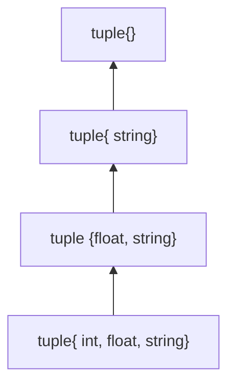

C++11和C++14新特性

<!-- more -->

# C++标准介绍

优秀的c++知识库:[cppreference](https://zh.cppreference.com/w/%E9%A6%96%E9%A1%B5)

C++标准演化

- **C++98(1.0)**    正式版本
- C++03(TR1)
- **C++11(2.0)**   正式版本
- C++14
- C++17
- C++20
- C++23

[编译器对C++11的支持情况](https://zh.cppreference.com/w/cpp/compiler_support/11)

两个层面的新特性

- 语言
  - Variadic Templates
  - move Semantics
  - auto
  - Range-base for loop
  - Initializer list
  - Lambdas
  - ...
- 标准库
  - type_traits
  - unordered_set
  - forward_list
  - array
  - tuple
  - Con-currency
  - regex
  - thread
  - bitset
  - ...

## 确认支持C++标准

程序内部由下面的宏标识C++标准

```cpp
//C++11
#define __cplusplus 201103L
//C++98
#define __cplusplus 199711L
//查询C++标准库
cout<<__cplusplus<<endl;
```

# 新的基础类型

## long long类型

以及unsigned long long类型

先后在C99加入和C++11加入

由于编译器兼容C/C++,因此C++11之前C99之后也能使用该类型

- 引入新的字面量后缀(LL以及ULL)

  **LL**  : `long long x=2147483647LL+1`;(2147483647为$2^31-1$,int类型的最大值)

  编译器对字面量默认以32位进行处理,上面例子中不写LL的话,值会变成-2147483648,因此需要编译器按照64位处理字面量则需要用到`LL`,此后结果为2147483648,恢复正常

- 判断最大值最小值

  - 最大值: `std::numeric_limits<long long>::max()`
  - 最小值: `std::numeric_limits<long long>::min()`
  - 针对unsigned long long是这样:`std::numeric_limits<unsigned long long>::max()`

##  新字符类型

### char16_t/char32_t

- `char16_t`	对应UTF16   16位长度
- `char32_t`    对应UTF32   32位长度

**字符串前缀**

```cpp
char16_t utf16c=u'好';
char32_t urf32c=u'好';

char16_t utf16[]=u"你好世界";
char32_t utf32[]=u"你好世界";
```

还有两个特殊基础类型:[wchar_t](#wchar_t)和[char8_t](#char8_t)

#### u16string/u32string

`std::u16string` 和 `std::u32string` 是 C++11 引入的用于存储 UTF-16 和 UTF-32 编码的字符串的类型

### wchar_t

windows编程常用字符类型,因为windows的API大部分都有这个wchar的版本

但是该类型不常用的,原因是对于跨平台不友好,在windows上和linux上的字符长度是不确定的

对应的字符串是wstring

### char8_t

对应utf8

C++20引入的新类型

c++20之前使用char

对应的字符串类型为u8string

**字符串前缀**

```cpp
//C++20之后的标准做法
char8_t c8a[]=u8"test";
char8_t c8=u8'c';
//C++17编译成功,C++20编译失败,需要char8_t
char c8a[]=u8"test";
char c8=u8'c';
//C++20编译失败,需要字符串前缀u8
char8_t c8a[]="test";
char8_t c8='c';
```

在实际开发中，可以考虑使用现有的开源库，如 ICU（International Components for Unicode）库，它提供了丰富的 Unicode 支持，包括对不同编码的字符串操作。

[[字符编码#字符集转换|字符编码的转换参考此处]]

# 内联命名空间与嵌套命名空间

## 内联命名空间

把子命名空间的元素导入到父命名空间中

注意: inline这个关键字不能用到第一层的命名空间中

```cpp
namespace Parent{
  namespace Child1{
    void foo(){cout<<"Child1::foo()"<<endl;
  }
	inline namespace Child2{
  		void foo(){ cout<<"Child2::foo()" <<endl;
  }
}
int main(){
	Parent::Child1::foo();
	Parent::foo();//调用的是Child2中的foo
}
```

> **主要作用** : **方便库的开发者管理代码,升级代码后无缝地提供给使用者.**当我们想去修改升级这个函数的时候,版本1换成版本2,最好的方式就是使用**内联命名空间**,本来inline是在版本1的namespace的,只需要将inline关键字转移到版本2的namespace上,则达成修改,其他代码无需修改,并且保留了原始版本代码

## 嵌套命名空间

主要是用来**减少命名空间带来的代码冗余**

```cpp
namespace A::B::C {
  int foo(){return  5;}
}
//这种方式是A嵌套的B嵌套的C命名空间中定义了一个foo函数
```

## 嵌套内联命名空间

**C++20**才支持

```cpp
namespace A::B{
  inline  namespace C{
    int foo(){return 5;}
  }
}
//等同于
namespace A::B::inline C{
  int foo(){return 5;}s
}
```

# 函数返回类型后置

基本语法:


一般用于推导函数模板返回类型

```cpp
auto test(int a,int b)->int
{
  return a+b;
}
```

# 右值引用

> C++11提出的一个非常重要的概念,它的出现不仅完善了C++的语法,改善了C++在数据转移时的执行效率,同时还增强了c++的模板能力
>
> c++11中对C++影响最深远的特性就是**右值引用**

首先区分左值和右值

- 判断对象能否取地址  可以取地址的为左值,不可以取地址的为右值
- 所谓的左值一般是指一个指向特定内存具有名称的值(具名对象),它有一个相对稳定的内存地址,并且有一段较长的生命周期.而右值则是不指向稳定内存的地址匿名值(不具名对象),它的生命周期很短,通常都是暂时性的

## 左值引用和右值引用

- 常量左值引用

  ```cpp
  int &x1 = 7;//编译错误
  const int &x1 = 11;//编译成功
  ```

- 右值引用语法

  ```cpp
  int &&k = 11;
  ```

右值引用引入了**移动语义**

### 值类别

- 分为2种: 泛左值(glvalue)和右值(rvalue)

  泛左值: 通过计算评估能够确定对象位域或函数的标识的表达式(简单理解就是具名对象)

- 分为3种: 左值,纯右值和将亡值

  纯右值: 通过计算评估,能够用于初始化对象和位域或者能够计算运算符操作数的值的表达式(简单理解为是为了初始化其他对象的)

  将亡值: 资源可以被重用的对象和位域,通常是因为它们接近生命周期的末尾,另外也有可能是经过右值引用的转换产生的


- 左值和将亡值统称为泛左值	
- 纯右值和将亡值统称为右值

### 左值转换为右值

#### 基本的转换方式

```cpp
int i=0;
int &&k1=i;	//编译失败
int &&k2=static_cast<int&&>i;	//编译成功
```

#### 使用std::move

[move函数详解](#move函数)

```cpp
static_cast<remove_reference<decltype(arg)>::type&&>(arg)
  //与使用move函数效果一致
```

> `remove_reference<>`：`remove_reference` 是一个模板元函数，是 C++11 标准引入的一个类型转换工具，位于 `<type_traits>` 头文件中,用于移除参数类型的引用修饰符。例如，如果 `arg` 的类型是 `int&`，`remove_reference<int&>::type` 将返回 `int`

## 移动语义

> 拷贝构造的时候,若被拷贝对象是一个右值或者是一个临时对象的时候,原本的做法非常不聪明.更高效的做法是将马上要被销毁的临时对象的资源内容移动到目标对象中

### move函数

`std::move` 是一个函数，其主要目的是将**任何类型的变量无条件地转化为右值**。

- 用于实现**移动语义**，减少不必要的拷贝开销和内存开销。
- 例如，将一个左值传入 `push_back` 时，可以使用 `std::move` 来实现真正的转移，避免额外的拷贝操作：

```cpp
std::vector<std::string> vec;
std::string x = "abcd";
vec.push_back(std::move(x));
```

有个问题是move函数的原理

> 学习的时候,可以利用:`-fno-elide-constructors`是一个编译选项，用于告诉编译器不要优化构造函数。通常情况下，编译器会尝试对构造函数进行优化，例如通过返回值优化（Return Value Optimization）来避免不必要的拷贝操作。使用该选项可以禁用这种优化，强制执行构造函数的拷贝操作。这在某些情况下可能有用，例如在调试时需要确保每次构造函数都被调用。

通过观察发现:移动语义可以将函数中的局部变量返回出来,观察汇编代码会发现,实际上根本没有进入到函数内,而是在进入函数前就定义了局部变量.意思就是本应在最里层的局部变量定义到了外面,这样当然就可以返回了

### 移动构造函数以及移动赋值运算符函数

C++的类中因此新增的默认函数:

- 移动构造函数
- 移动赋值运算符函数

```cpp
myClass(myClass&& other){}//移动构造函数
myClass operator=(myClass&& other){}//移动赋值运算符函数
```

[可以参考这个链接查看汇编](https://godbolt.org/z/h3x8dnT17)

## 万能引用

**万能引用**是针对**模板**而来的

常量左值引用既可以引用左值又可以引用右值,是一个几乎万能的引用,但可惜由于其常量性,导致它的使用范围收到一些限制.因此此处介绍的万能引用是真正意义上的"万能"的引用

[右值引用](#右值引用)  --模板->  万能引用:

- 具体类型的&&符号表示右值引用

- 模板的&&符号表示[万能引用](#万能引用)

> 所谓的万能引用是因为发生了类型推导，在T&&和auto&&的初始化过程中都会发生类型的推导，如果已经有一个确定的类型，比如int &&，则是右值引用。在这个推导过程中，初始化的源对象如果是一个左值，则目标对象会推导出左值引用；反之如果源对象是一个右值，则会推导出右值引用，不过无论如何都会是一个引用类型。
> 万能引用能如此灵活地引用对象，实际上是因为在C++11中添加了一套引用叠加推导的规则——[引用折叠](#万能引用的规则)。在这套规则中规定了在不同的引用类型互相作用的情况下应该如何推导出最终类型

```cpp
void foo(int &&i){}//i为右值引用

template<class T>
void bar(T &&t){}  //t为万能引用

int &&x=get_val();//x为右值引用

auto &&y=get_val();//y为万能引用
```

万能引用既可以是一个左值引用,也可以是一个右值引用,这个能力是通过模板形参的推导完成的

万能引用最重要的一个应用是[完美转发](#完美转发)

### 万能引用的规则

万能引用使用了一套叫做**引用折叠**的规则,即不同引用类型叠加后的推导结果

| 类模板型 | T实际类型 | 最终类型 |
| -------- | --------- | -------- |
| T&       | R         | R&       |
| T&       | R&        | R&       |
| T&       | R&&       | R&       |
| T&&      | R         | R&&      |
| T&&      | R&        | R&       |
| T&&      | R&&       | R&&      |

- 类模板型和T实际类型均有引用符,则按照数量少的引用符确定最终类型
- 类模板型和T实际类型有一个有引用符,则按照有引用符的数量来确定最终类型

或者另一个记忆方式:(按照优先级来罗列)

1. 有左值引用,则最终类型为左值引用(优先级最高)
2. 有右值引用,则最终类型为右值引用

值得一提的是万能引用的形式必须是`T&&`或者`auto&&`,而不能是`vector<T>&&`,必须在初始化的时候被直接推导出来,若在推导中出现中间过程,则不是一个万能引用

### 完美转发

```cpp
//下面三种方式都不是完美转发,都有各自的问题:
//执行过程中会执行构造函数,因为是按值转发,即在转发过程中会额外发生一次临时对象的复制
template<class T>
void normal_forwarding1(T t)
{
	show_type(t);
}

//解决了上面效率的问题,但是不能转发右值
template<class T>
void normal_forwarding2(T &t)
{
  show_type(t);
}

//能转发右值了,但是即使传左值也无法修改了
template<class T>
void normal_forwarding3(const T &t)
{
  show_type(t);
}
```

**完美转发**

原来是左值,转发后也是左值;原来是右值,转发后也是右值

```cpp
template<class T>
void perfect_forwarding(T &&t)
{
  //t传入的是左值的话,在此处会和右值折叠还是左值
  //t传入的是右值的话,在此处会和右值折叠还是右值
  show_type(static_cast<T&&>(t));//这里必须是T&&,因为只有T&&可以推导出右值
}
//显示使用static_cast类型转换进行转发不是一个便携的方法.在C++11的标准库中提供了一个std::forward函数模板,在函数内部也是使用static_cast进行类型转化
//使用forward转发语义会表达得更加清晰
template<class T>
void perfect_forwarding(T &&t)
{
  show_type(std::forward<T>(t));
}
```

- `std::forward` 用于在模板函数中**完美转发**参数。
- 它有条件地将变量转化为右值，只有当输入的变量是右值时，才会将其转化为右值引用；如果输入的变量是左值，那么 `forward` 将输入的变量转化成左值。
- 通常用于保留原始变量的左值和右值属性。

# 非静态成员默认初始化

 从C++11开始,声明**非静态数据成员**的同时,可以直接对其使用**等号或大括号进行初始化**

> 以前只有类型为整形或者枚举类型的常量静态数据成员才可以进行这种默认初始化

```cpp
class X{
 int a =0 ;
 double b{0};
 string c{"hello world"};
}
```

C++20开始,允许我们对数据成员的位域进行默认初始化了

```cpp
struct S{
 int y:8=11; 
 int z:4{7};
}
```


# 可变参数模板

**Variadic Templates**

[[C++基础#模板|基础模板知识点参阅]]

关键词: `...`

`...`就是一个所谓的pack(包)

- 用于模版参数就是模版参数包
- 用于函数参数类型就是函数参数类型包
- 用于函数参数就是函数参数包

> 使用这种语法能兼容两个变化点,模板参数的两个点:
>
> - 参数个数(variable number)
>
>   本质是利用参数个数逐一递减的特性,实现递归函数调用.使用函数模板完成
>
> - 参数类型(different type)
>
>   本质是利用参数个数逐一递减导致参数类型也逐一递减的的特性,实现递归继承或递归复合,使用类模板完成

> 设计函数的时候
>
> - 当希望函数参数是类型不同,个数也不同的时候,采用可变参数模板
>
> - 当希望函数参数只有个数不同,类型相同的时候,可以采用[initializer_list](#一致性初始化),但是调用的时候需要多写一对`{}`
>
>   这种情况也可以使用可变参数模板,只需要在定义 参数为[1+包]的函数时,使第一个参数的类型固定,而不是模板类型.

## 函数案例

针对下面的情况:

```cpp
void print()
{}

template <typename T,typename... Types>
void print(const T& firstArg,const Types&... args)
{
  cout<<firstArg<<endl;
  print(args...);
}
```

args可以为任意数量(包含0个)的参数,并且每个参数可以是任何类型的(args为一包类型的一包参数)

`sizeof...(args)`用于**查看包中的个数**

但print函数的参数为0个时,因为0个参数没办法拆分为1+0,所以会走`void print()`,即作为递归的终止条件

更复杂的版本:

```cpp
//要求是传入什么类型就输出什么类型,用%符号来占位,%%表示%本身
void myPrint(const char* s)
{
    while(*s)
    {
        cout<<*s++;
    }
}

template<typename T,typename... Ts>
void myPrint(const char* s,T first,Ts... others)
{
    while(*s)
    {
        if(*s=='%'&&*(s+1)!='%')
        {
            //找到占位符
            cout<<first;
            //退出前继续打印接下来的
            myPrint(++s,others...);//++s跳过百分比符号
            return;
        }
        else if(*s=='%'&&*(s+1)=='%')
        {
            cout<<'%';
            s+=2;
        }
        else
            cout<<*s++;
    }
}
```

## 类案例

> 下面的案例是tuple(元组),tuple可以任意指定多个不同类型的成员,构造出一个对象
>
> 实现方式是通过[可变参数模板](#可变参数模板)实现的**递归继承**
>
> 流程可描述为:将tuple类模板的类型分为[1+一包],先定义一个类型为第一个参数的类型,使该类继承自类型为[一包]的类型的类.(下方代码下面有贴继承链)

```cpp
//下面案例是元组
template<typename... Values> class tuple;//模板的声明，用于告诉编译器有一个名为`tuple`的模板类存在，但具体的实现将在后面的代码中提供

template<> 
class tuple<> {};//作为终止条件的空类

template<typename Head,typename... Tail>
class tuple<Head,Tail...>:private tuple<Tail...>//递归继承
{
  //定义tuple的继承类型
	typedef tuple<Tail...> inherited;
  public:
  //构造函数
  tuple(){}
  tuple(Head v,Tail... vtail):m_head(v),inherited(vtail...)//初始化列表,inherited(vtail...)表示调用父类的构造函数
  {}
  //定义函数head
  Head head() {return m_head;}
  //C++14前也可以写成这种声明方法(返回类型后置写法):auto head() -> decltype(m_head) { return m_head; }
  //定义函数tail
  inherited& tail() {return *this;}//return后转型为inherited,这是一个巧妙的函数,通过该函数作为桥梁用于访问所有元素
  protected:
  //定义成员变量m_head
  Head m_head;
};
```

参照如下的继承链理解:(下图使用 `{}` 代替 `<>`)



使用上面案例的情况如下:

```cpp
tuple<int,float,string> t(41,6.3,"nico");
t.head();   //-->获得41
t.tail().head();  //-->获得6.3
t.tail().tail().head();   //-->获得"nico"
```

## 并存问题

```cpp
template <typename T,typename... Types>
void print(const T& firstArg,const Types&... args)

template <typename... Types>
void print(const Types&... args)
```

上面这种情况参数为[1+包]和[包]的两个重载函数可以并存

注意:当调用print函数传入多个参数时,**参数为[1+包] 比 [包] 更特化**,调用的是[1+包]那个函数,即 `void print(const T& firstArg,const Types&... args)`.因此当他们共同存在的时候,参数为[包]的函数就永远不会被调用到了.

可变参数模版的作用:1.递归

# 模版表达式中的空格

```cpp
vector<list<int> >;    //每个C++版本的都支持
vecot<list<int>>;    //从C++11开始支持
```

# nullptr

> nullptr是C++11引入的空指针常量用于代替NULL或者0赋值给空指针

例子如下:

```cpp
//有两个函数
void f(int);
void f(void*);
//调用哪个函数?
f(0);				//调用f(int)
f(NULL);    //调用f(int)
f(nullptr); //调用f(void*)
```

## nullptr_t

顾名思义,**nullptr的类型**

`typedef decltype（nullptr）nullptr_t；`

`nullptr_t`是一个与 `nullptr` 具有相同类型的类型。

用处:为了在代码中使用更具有语义的类型,例如:可以使用 `nullptr_t` 来声明接受空指针的函数参数或返回类型，以增加代码的清晰度和可读性。

# auto关键字

**auto**表示任意类型

声明变量时根据初始化表达式自动推断该变量的类型,声明函数时函数返回值的占位符

> auto一大用处是当类型非常长或非常复杂的时候使用,合理使用auto可以减少代码冗余

```cpp
//非常长,如:iterator
vector<string> v;
//vector<int>::iterator pos = v.begin();
auto pos=v.begin();

//非常复杂,如:lambda
auto l=[](int x)->bool{
  //...
};
```

## **auto关键字的特性**

- 从左往右的推导

  ```cpp
  auto x=1,y=4.2;
  //从左往右x会先被推导为int类型,因此后半段会报错;
  ```

- 使用表达能力更强的类型

  ```cpp
  //此处会推导出x的类型为double而不是int类型,虽然这里的条件表达式最终返回的是1
  auto x=true?1:4.2;
  static_assert(std::is_same<decltype(x),double>::value);
  ```

- **不能声明非静态成员变量**

- **C++20之前无法声明形参**

## 推导规则

- 按值初始化

  忽略CV限定符,即const和volatile两种

  ```cpp
  const int i = 5;
  auto j = i;
  //推导出j为int类型
  ```

- 按引用初始化

  忽略引用

  ```cpp
  int i =5;
  int &j=i;
  auto m=j;
  //m是int类型
  ```

- 万能引用

  ```cpp
  int i =5;
  auto&& m=i;
  auto&& j=5;
  //auto推导为int类型,j为int&&
  ```

- 数组或者函数

  会推导为指向相应类型的指针

  ```cpp
  int i[5];
  auto m = i;
  auto推导为指向int类型的指针
  ```

- [列表初始化](#一致性初始化)

  该项在C++17标准和其之前的标准有区别,这里只提c++17之后的标准

  - 直接使用列表初始化

    列表里必须是单个元素,则auto推导为元素的类型

    多个元素,编译无法通过

  - 使用等号赋值的列表初始化

    auto推导的类型是[initializer_list](#一致性初始化)

## auto占位符使用

> 从**C++14**开始支持使用auto来推导函数的返回类型,此时不需要使用返回类型后置的语法

- **返回类型推导**

  要求统一返回类型,如果在if else中返回多个不同类型,编译无法通过

  ```cpp
  auto sum(int a1,int a2){return a1+a2;}
  ```

- **lambda表达式的形参中使用auto**

  C++14开始支持,给auto增加了一定的泛型能力

  ```cpp
  auto l=[](auto a1,auto a2){return a1+a2;};
  auto retval=l(5,5.0);
  ```

- **非类型模板形参占位符**

  C++17开始支持

  ```cpp
  template<auto N>
  void f(){
    cout<<N<<endl;
  }
  ```

[auto与decltype配合使用详情](#decltype和auto配合使用)

# 一致性初始化

Uniform Initialization

列表初始化的主要目的是**让stl容器如同数组一般的被初始化**

> 传统初始化方式主要是两种
>
> - 使用括号初始化的方式叫做**直接初始化**
>
>   ```cpp
>   int x(8);
>   C x2(4);
>   ```
>
> - 使用等号初始化的方式叫做**拷贝初始化**
>
>   ```cpp
>   int x=8;
>   C x2=4;
>   ```

现在,**任何变量的初始化都可以用一个共通语法设置初值**: `{}`

他也分为直接初始化和拷贝初始化

```cpp
int values[]{1,2,3};
vector<int> v{2,3,5,7,11,13,17};//直接初始化
//vector<int> v={2,3,5,7,11,13,17};//拷贝初始化
//编号1(下面有讲解)
vector<string> cities{
  "Berlin","New York","London","Braunschweig","Cairo","Cologne"
};
//编号2代码(下面有讲解)
complex<double>c{4.0,3.0};
```

其实是利用一个事实:编译器看到{t1,t2...tn}便做出一个`initializer_list<T>`,它关联到一个`array<T,n>`.调用函数(例如ctor(构造函数))时该array内的元素可被编译器分解逐一传给函数.但若函数参数就是个`initializer_list<T>`,调用者不会分解逐一传给函数,而是作为一个`initializer_list<T>`传入

- 编号1代码:这形成一个`initializer_list<string>`,背后有个`array<string,6>`.调用`vector<string> ctors`时编译器找到了一个`vector<string> `接受`initializer_list<string>`的构造函数.**所有stl容器都有这种构造函数**
- 编号2代码:这形成一个这形成一个`initializer_list<double>`,背后有个`array<double,2>`.调用`complex<double> `构造函数时该array内的2个元素被分解传给构造函数.`complex<double>`并无任何构造函数接受`initializer_list<double>`参数

## initializer_list\<T\>

Initializer Lists

初始化列表不填任何东西会被0初始化(若是指针则初始化为nullptr)

```cpp
int i;//i未被初始化
int j{};//j被初始化为0
int* p;//p未被初始化
int* q{};//q初始化为nullptr
```

初始化列表不允许大空间到小空间的转换(narrowing:收缩)

```cpp
int x1(5.3);	//OK			x1=5
int x2 = 5.3;		//OK    x2=5
int x3{5.0};		//ERROR:narrowing
int x4 = {5.3};		//ERROR:narrowing
char cl{7};				//OK 尽管7是int,但没有收缩
char c2{99999};		//ERROR:narrowing
std::vector<int> v1{1,2,4,5};	//OK
std::vector<int> v2{1,2.3,4,5.6};	//ERROR:narrowing
```

上面的ERROR在gcc中是warning

## 使用

为了支持用户定义类型的初始化列表概念，C++11提供了类模板`std::initializer_list`。它可用于支持通过值列表进行初始化，或者在任何其他只需要处理值列表的地方使用。

```cpp
void print(std::initializer_list<int> vals)
{
  	for(auto p=vals.begin();p!=vals.end();++p){
			std::cout<<*p<<endl;
    }
}
print({12,3,5,7,11,13,17});
//传给initializer_list的,一定必须也是个initializer_list或者{...}形式
```

**优先级问题**

`如果同时有两个函数P(int a,int b)或者P(initializer_list<int> initlist)`当执行 `P q{77,5};`会**优先调用后者**

> 对[[STL]]容器的影响:如今**所有容器**都接受指定任意数量的值用于构建或赋值或`insert()`或`assign()`;`max()`和`min()`也可以接受任意参数.
>
> ```cpp
> vector<int> v1{2,5,7,12,34,45,56};
> vector<int> v2({2,5,7,69,83,50});
> vector<int> v3;
> v3 ={2,5,7,13,69,83,50};
> v3.insert(v3.begin()+2,{0,1,2,3,4});
> max({string("Ace"),string("Stacy"),string("Sabrina"),string("Barkley")});
> min({54,16,48,5});
> //要注意的是:
> vector<int>(1)//创建临时的空间大小为1的vector<int>,里面的值是不确定的
> vector<int>{1}//创建临时的空间里面的值是1的vector<int>
> ```

## initializer_list原理

**initializer_list内部的实现实际上是对array的引用(头指针和长度)**,没有包含array

因此如果复制initializer_list产生的另一个initializer_list,双方是同一个array的引用

## 初始化列表不支持隐式缩窄转换

**列表初始化由宽类型转为窄类型编译无法通过**

```cpp
int  x=999;
char c1=x;//编译成功,传统变量初始化支持隐式缩窄转换
char c2{x};
```

## 指定初始化

> 为了提高数据成员初始化的可读性和灵活性
>
> C++20标准引入了**指定初始化**的特性
>
> C语言在C99标准就已经支持该功能了

```cpp
//基本语法
struct Point{
  int x;
  int y;
};
Point p{.x = 4, .y=2};
```

### 语法要求

1. 必须是一个聚合类型
2. 数据成员必须是非静态数据成员
3. 数据成员最多只能被初始化一次
4. 非静态数据成员的初始化**必须按照声明的顺序**进行
5. 针对联合体中的数据成员只能初始化一次,不能同时指定
6. 不能嵌套指定初始化数据成员
7. 一旦使用指定初始化就不能混用其他方法对数据成员初始化了
8. 禁止对数组使用指定初始化

# for循环的特殊写法

for的一种语法糖

> 这种语法只适用于支持[[STL#迭代器|迭代器]]访问的容器

```cpp
for(decl:coll)
{
  //statement;
}
//decl:声明
//coll:支持迭代器操作的容器

//其实本质上就是如下代码
for(auto _pos=coll.begin();pos!=coll.end();++_pos){
  decl=* _pos;
	//slatement
}
```

也由于其本质是属于隐式转换

```cpp
class C{
  public:
  explicit C(const string& s);//该构造函数不能隐式类型转换
  //...
};
vector<string> vs;
for(const C& elem: vs){//此处会报错:不存在从sting类型到C类型的转换
  //原因正是因为隐含的decl=* _pos;执行失败
	cout<<elem<<endl;
}
```

for语法糖的其他例子:

```cpp
for (int i : {12, 3, 5, 7, 9, 13, 17, 19})
{
    cout << i << endl;
}
vector<double> vec;
for(auto elem:vec){
  cout<<elem<<endl;
}
//下面的方式才可以真正修改值
for(auto& elem:vec){
  elem*=3;
}
```

# 默认和删除函数

C++11引入`=default`,`=delete`

> C++标准允许编译器为类自动添加一些函数,这些函数被称为:**类的特殊成员函数**,如下:
>
> - 默认构造函数
> - 析构函数
> - 拷贝构造函数
> - 拷贝赋值运算符
> - [移动构造函数](#移动构造函数以及移动赋值运算符函数)
> - [移动赋值运算符](#移动构造函数以及移动赋值运算符函数)
>
> **声明任何构造函数都会抑制默认构造函数的添加**,上面除了析构函数之外,其余的都是构造函数(Big-Five)

如果你加上`=default`,编译器就会给你生成(如果有的话)一个默认版本.如果加上`=delete`表示不要编译器给我生成默认版本

```cpp
class Zoo
{
public:
  Zoo(int i1,int i2):d1(i1),d2(i2){}
  //拷贝构造函数
  Zoo(const Zoo&)=delete;
  //move构造函数   右值引用 
  Zoo(Zoo&&)=default;
  //拷贝赋值函数
  Zoo& operator=(const Zoo&)=default;
  //move赋值函数
  Zoo& operator=(const Zoo&&)=delete;
  virtual ~Zoo(){}
private:
  int d1,d2;
};
```

> C++类中会给函数的无参构造函数,拷贝构造函数,拷贝赋值构造函数自动生成默认版本的定义(浅拷贝),在C++2.0后多了两种会自动生成的构造函数,总共五种(俗称Big-Five).
>
> p.s. 这种默认生成的构造函数全是public且inline的

- `=default`用于Big-Five之外是无意义的
- `=delete`可用于任何函数身上(p.s. `=0`只能用于virtual函数

注意:不要同时使用`explicit`和`=delete`

```cpp
struct type
{
	type(long long){}
  explicit type(long)=delete;
};
void foo(type){}
int main()
{
	foo(type(58L));//此句无法编译通过,因为显示调用,执行了explicit type(long)=delete;函数,却被delete掉了
  foo(50L);//此句可以编译通过
} 
```


# 非受限联合类型

传统联合类型的成员类型不能是一个非平凡类型(成员类型不能有自定义的构造函数)

```cpp
union U
{
	int x1;
  float x2;
  string x3;//无法编译通过
};
```

于是C++20以后,非受限联合类型得到了支持,若联合类型中存在非平凡类型,则该联合体的构造和析构函数将被隐式删除,**必须在联合体中定义构造和析构函数**

```cpp
union U{
  U():x3(){}//存在非平凡类型成员,必须提供构造函数
  ~U(){x3.~basic_string();}//存在非平凡类型成员,必须提供析构函数
  int x1;
  float x2;
  string x3;//非平凡类型
  vector<int> x4;//非平凡类型
};
void main()
{
 	U u;
  u.x3 = "hello world";
  cout<<u.x3;
}
```


# 类型别名

类似typedef

关键字:using   对该关键词赋予了新的意义

```cpp
//定义一个func类型
typedef void (*func)(int,int);
	//等同于:
using func=void(*)(int,int);
```

这种语法超脱于typedef的地方就在于[别名模板](#别名模板)

# noexcept

C++11 为了替代 `throw()` 而提出的一个新的关键字`noexcept`

关键词: `noexcept(常量表达式)` 

常量表达式的结果会被转换成一个 bool 类型的值，该值为 true，表示函数不会抛出异常，反之则可析构函数和移动构造函数能抛出异常。而不带常量表达式的 noexcept相当于声明了 noexcept(true)，即不会抛出异常。

```cpp
void foo() noexcept;
//上下两种方式相等:表示一定没有异常
void foo() noexcept(true);
```

- noexcept 可以用来阻止异常的传播和扩散

- noexcept 作用于模板时，则增强了 c++ 的泛型编程的能力

- noexcept 更大的用处就是保证程序的安全。

  因此出于安全考虑,C++11 标准中类的析构函数默认为 `noexcept(true)`。但是，如果程序员显式地为析构函数指定了
  `noexcept(false)` 或者类的基类或成员有 `noexcept(false)` 的析构函数，析构函数就不会再保持默认值。

- 提高效率

  移动构造函数默认为 `noexcept(true)`,可以去除一些异常处理机制,提高效率

# override

覆写,改写

应用在虚函数身上,表示对虚函数的覆写

```cpp
virtual void vfunc(int) override {}
```

# final

表明为最终继承类

```cpp
struct Base1 final{};

struct Derived1:Base1{};//Error cannot derive from 'final' base 'Base1' in derived type 'Derived1'
```

表明为最终覆写虚函数,不能再往下覆写了

```cpp
struct Base2{
  virtual void f() final;
};

struct Derived2: Base2{
  void f();//Error:overriding final function 'virtual void Base2::f()'
};
```

## 局部数组可用变量初始化大小

```cpp
int a=10;
int b[a];
```

C++11标准之后，允许使用变量来初始化数组的大小。

> 但注意**只能在函数内部定义的数组中使用，不能作为类的成员变量或全局变量使用。**

# decltype

> 用于获取表达式的类型

在c++1.0中可以通过`typeid`得到类型名的一串字符串

```cpp
const std::type_info& type = typeid(num);
std::cout << "Type: " << type.name() << std::endl;
```

**但是获取到的类型只是字符串,无法真正使用该类型**,并且各编译器返回的字符串还不相同

虽然彼时C++有些编译器支持typeof可以实现此功能,但并非标准

```cpp
int a=0;
typeof(a) b=5;
//上面这行等价于int b=5;
```

**decltype正是可以实现类似typeof的功能,并且同时具备完备的兼容性**

## 使用方式

```cpp
map<string,float> coll;
decltype(coll)::value_type elem;//定义了一个与coll变量相同类型的变量elem
//在C++11之前上面代码可以理解成如下:
map<string,float>::value_type elem;
```

## 推导规则

decltype(e)（其中e的类型为T）的推导规则有五条：

1. 如果e是一个**未加括号的标识符表达式**（结构化绑定除外）或者未加括号的类成员访问，则decltype(e)推断出的类型是e的类型T。如果并不存在这样的类型，或者e是一组重载函数，则无法进行推导。

   *潜台词就是下面其他规则都是带括号的e:*

2. 如果e是一个函数调用或者仿函数调用，那么`decltype(e)`推断出的类型是其返回值的类型
3. 如果e是一个类型为T的左值，则`decltype(e)`是`T&`
4. 如果e是一个类型为T的将亡值，则`decltype(e)`是`T&&`
5. 除去以上情况，则`decltype(e)`是`T`

CV限定符的推导

- 通常情况下,`decltype(e)`所推导的类型会同步e的cv限定符
- 当e是**未加括号的成员变量时**,父对象表达式的cv限定符会被忽略

```cpp
const int&& foo();
int i;
struct A{
  double x;
};
const A* a=new A();
decltype(foo());//符合规则2,推导类型为const int&&
decltype(i);//符合规则1,类型为int
decltype(a->x);//符合规则1,类型为double,因为cv限定符规则的第二条,因此未同步对象a带有的const限定符
decltype((a->x));//符合规则3,因为a->x是一个左值,又因为a带有const限定符,所以类型被推导为const double的引用类型,即const double&
```

## decltype和auto配合使用

- 用decltype的推导表达式规则来推导auto

  ```cpp
  auto x1=(i);//按照auto的推导规则:x1推导为int
  decltype(auto) x2=(i);//按照decltype的推导规则:x2推导为int&
  ```

- 为非类型模板形参占位符

  ```cpp
  templatye<decltype(auto) N>
  void f()
  {
  	cout<<N<<endl;
  }
  ```

## 主要作用

### 声明返回类型

```cpp
template<typename T1,typename T2>
decltype(x+y) add(T1 x,T2 y);  //返回类型为x+y后的结果的类型
```

上面这种情况想要实现的效果编译无法通过,因为编译器从左到右识别到`x+y`的时候,他还不知道x和y是什么,因此编译报错:

C++2.O又出现了一种新语法,如下:

```cpp
template<typename T1,typename T2>
auto add(T1 x,T2 y)->decltype(x+y);//auto让编译器找类型,紧接着的->符号与编译器表明类型
```

这种语法和[lambdas](#Lambda表达式)定义的方式很像,下面是lambdas表达式的定义方式:
$$
\left[...\right]\left(...\right)\text{mutable}_{opt}\ \textit{ throwSpec}_{opt}\text{ -> retType}_{opt}\left\{...\right\}
$$

### 用于元编程

```cpp
//该函数针对容器
template<typename T>
void test18_decltype(T obj)
{
  //当我们手上有类型的时候,可以取其inner typedef
	map<string,float>::value_type elem1;
  
  //面对对象可以取其类的类型,因为现在我们有了工具decltype
  map<string,float> coll;
  decltype(coll)::value_type elem2;
  
  //下面是故意设计本测试函数为template function,接受任意参数T obj,假设他接受的是容器,获取他的类型又该如何获取
  typedef typename decltype(obj)::iterator iType;
  //由于编译器见到obj的时候还无法确定他是什么,所以要加typename辅助编译器认识decltype(obj)::iterator是个类型,然后使用typedef将该类型起别名为iType
```

> `value_type`是STL容器的一个成员类型别名，用于表示容器中存储的元素类型。在STL容器中，`value_type`通常用于定义容器内元素的类型，方便编写通用的泛型代码。另外针对map这种容器,还有`key_type`可以获取其键的类型

### 传递lambda表达式的类型

> 面对[lambda](#lambda表达式),我们手上往往只有对象,没有类型,要获得其类型,就得借助于decltype

```cpp
auto cmp=[](const Person& p1,const Person& p2){
  return p1.lastname()<p2.lastname()||(p1.lastname()==p2.lastname()&&p1.firstname()<p2.firstname());
};
//定义set需要用到上面lambda表达式的类型
set<Person,decltype(cmp)> coll(cmp);
//创建一个名为`coll`的`set`容器对象，其中元素的类型是`Person`，使用`cmp`作为排序比较函数
```

p.s. 如果传入的值不是lambda,报错会特别晦涩难懂(即上文中的coll括号中的cmp).对于自定义排序函数来说一个普通的函数还是更直观

# 别名模板

Alias Template   带参数的类型别名

关键字:using   对该关键词赋予了新的意义

```cpp
//定义
template <typename T>
using Vec=std::vector<T,MyAlloc<T>>;
//使用
Vec<int> coll;  //这里的int类型被传入了别名模版中
	//与下面相等
std::vector<int,MyAlloc<int>> coll;
```

使用`#define`和`typedef`无法达到类似的效果


需要注意的是:别名模版不能[[C++基础#函数模特化|函数模板特化]]与[[C++基础#类模板特化|类模板特化]]

# Lambda表达式

> Lambda看起来像一个函数,实际上是一个**对象**

C++11中的Lambda表达式**用于定义并创建匿名的 [函数对象](#函数对象（难点）)**，以简化编程工作。

> Lambda表达式最简形式:
>
> ```cpp
> //下面的函数是把lambda表达式写成内联函数(inline)
> //其实是定义了一个类,定义该类的仿函数函数体如下代码,定义为这个类的对象,如果用变量接收,接收到的是一个匿名的函数对象
> auto f=[]{
>   cout<<"hello lambda"<<endl;
> }
> //调用函数对象
> f();
> 
> //=======上面写法与下面写法等同=========  
> 
> //定义一个类并创建对象并且调用该函数对象的仿函数
> []{
>   cout<<"hello lambda"<<endl;
> }();
> ```

**Lambda表达式完整构成**

```cpp
[capture](parameters) mutable ->return-type
{
	statement
}
```

$$
\left[...\right]\left(...\right)\text{mutable}_{opt}\ \textit{ throwSpec}_{opt}\text{ -> retType}_{opt}\left\{...\right\}
$$

*opt表示该项可选,三个可选项只要有一个存在,就必须写小括号*

① 函数对象参数；

> [\]，**捕获列表**:标识一个**Lambda的开始**，这部分必须存在，**不能省略**。函数对象参数是传递给编译器自动生成的函数对象类的构造函数的。函数对象参数只能使用那些到定义Lambda为止时**Lambda所在作用范围内可见的局部变量**（包括Lambda所在类的this）(这里指明局部变量的原因是因为全局变量本来就可以在类中被使用,如果使用全局变量或者static变量,一般会**被编译器警告**)。函数对象参数有以下形式：

-   空。没有使用任何函数对象参数。
-   =。函数体内可以使用Lambda所在作用范围内所有可见的局部变量（包括Lambda所在类的this），并且是**值传递方式**（相当于编译器自动为我们按值传递了所有局部变量）。
-   &。函数体内可以使用Lambda所在作用范围内所有可见的局部变量（包括Lambda所在类的this），并且是**引用传递方式**（相当于编译器自动为我们按引用传递了所有局部变量）。
-   this。函数体内可以使用Lambda所在类中的成员变量。
-   a。将a按值进行传递。按值进行传递时，函数体内不能修改传递进来的a的拷贝，因为默认情况下函数是const的。**要修改传递进来的a的拷贝**，可以添加mutable修饰符。
-   &a。将a按引用进行传递。
-   a, &b。将a按值进行传递，b按引用进行传递。
-   =，&a, &b。除a和b按引用进行传递外，其他参数都按值进行传递。
-   &, a, b。除a和b按值进行传递外，其他参数都按引用进行传递。

C++14标准开始定义了**广义捕获**,分为下面两种

- 简单捕获(上方介绍的为简单捕获)

- 初始化捕获

  ```cpp
  int x=5;
  auto foo=[r=x+1]{return r;};
  //r的作用域为lambda表达式中
  ```

② 操作符重载函数参数；

> 标识重载的()操作符的参数，没有参数时，这部分可以省略。参数可以通过按值（如：(a,b)）和按引用（如：(&a,&b)）两种方式进行传递。注意是要带类型的,C++14开始类型还可以使用auto.

③ 可修改标示符；

> mutable声明，这部分可以省略。按值传递函数对象参数时，**加上mutable修饰符后，才可以修改按值传递进来的拷贝**（注意是能修改拷贝，而不是值本身）

```cpp
QPushButton * myBtn = new QPushButton (this);
QPushButton * myBtn2 = new QPushButton (this);
myBtn2->move(100,100);
int m = 10;
connect(myBtn,&QPushButton::clicked,this,[m] ()mutable { m = 20; qDebug() << m; });
connect(myBtn2,&QPushButton::clicked,this,[=] () { qDebug() << m; });
qDebug() << m;
```

④ 函数返回值；

> ->返回值类型，标识函数返回值的类型，当返回值为void，或者函数体中只有一处return的地方（此时编译器可以自动推断出返回值类型）时，这部分可以省略。

⑤ 是函数体；

{}，标识函数的实现，这部分不能省略，但函数体可以为空。

**很重要的一点**: [利用decltype获取lambda表达式的类型](#传递lambda表达式的类型)

## Lambdas的一些注意点

### 无状态Lambda表达式

从C++20开始,对于**无状态Lambda表达式**是可以构造和赋值的

即可以隐式转换为函数指针

解决了无法就地编写内嵌函数的尴尬问题

> 捕捉上下文变量(即捕获列表`[]`中是否有东西)，不管实际函数体中有没有用到上下文变量，只要不活了上下文变量都属于**有状态 lambda** 
>
> 在需要函数回调为参数的函数中非常有用

```cpp
void f(void(*)()){}
void g(){
  f([]{};)
}
```

### 捕获[*this]和[=,this]

- `[*this]`:拷贝this对象
- `[=,this]`:是为了区分`[=,*this]`

### 模板语法的泛型lambda表达式

从C++20开始,可以使用下面语法:

```cpp
auto f=[]<typename T>(vector<T> vector){};
```


## Lambdas案例细节

mutable值传递,引用传递,以及值传递,三种情况的比较如下: 

```cpp
//mutable值传递
int id = 0;
auto f = [id]()mutable{
  cout<<id<<endl;
  ++id;
};
id = 42;
f();
f();
f();
cout<<id<<endl;
//输出内容如下:
0
1
2
42

//引用传递
int id = 0;
auto f = [&id](){
  cout<<id<<endl;
  ++id;
};
id = 42;
f();
f();
f();
cout<<id<<endl;
//输出内容如下:
42
43
44
45
  
//值传递
int id = 0;
auto f = [id](){
  cout<<id<<endl;
  ++id;//此处报错,不可修改
};
id = 42;
f();
f();
f();
cout<<id<<endl;
//报错:[Error] increment of read-only variable 'id'
```


## 函数对象（难点）

重载函数调用操作符的类，其对象常称为**函数对象（function object）**，即它们是行为类似函数的对象，也叫**仿函数(functor)**,其实就是重载“()”操作符，使得类对象可以像函数那样调用。

注意：

1. 函数对象(仿函数)是一个类，不是一个函数。
2. 函数对象(仿函数)重载了”() ”操作符使得它可以像函数一样调用。

分类:假定某个类有一个重载的operator()，而且重载的operator()要求获取一个参数，我们就将这个类称为“一元仿函数”（unary functor）；相反，如果重载的operator()要求获取两个参数，就将这个类称为“**二元仿函数**”（binary functor）。

函数对象的作用主要是什么？**STL提供的算法往往都有两个版本，其中一个版本表现出最常用的某种运算，另一版本则允许用户通过template参数的形式来指定所要采取的策略。**

```cpp
//函数对象是重载了函数调用符号的类
class MyPrint
{
public:
	MyPrint()
	{
		m_Num = 0;
	}
	int m_Num;

public:
	void operator() (int num)
	{
		cout << num << endl;
		m_Num++;
	}
};

//函数对象
//重载了()操作符的类实例化的对象，可以像普通函数那样调用,可以有参数 ，可以有返回值
void test01()
{
	MyPrint myPrint;
	myPrint(20);

}
// 函数对象超出了普通函数的概念，可以保存函数的调用状态
void test02()
{
	MyPrint myPrint;
	myPrint(20);
	myPrint(20);
	myPrint(20);
	cout << myPrint.m_Num << endl;//调用次数
}

void doBusiness(MyPrint print,int num)
{
	print(num);
}

//函数对象作为参数
void test03()
{
	//参数1：匿名函数对象
	doBusiness(MyPrint(),30);
}
```

总结：

1. 函数对象通常不定义构造函数和析构函数，所以在构造和析构时不会发生任何问题，避免了函数调用的运行时问题。
2. 函数对象超出普通函数的概念，函数对象可以有自己的状态
3. 函数对象可内联编译，性能好。用函数指针几乎不可能
4. 模版函数对象使函数对象具有通用性，这也是它的优势之一 

### 谓词

> 谓词是指**普通函数**或**重载的operator()**返回值是bool类型的函数对象(仿函数)。如果operator接受一个参数，那么叫做**一元谓词**,如果接受两个参数，那么叫做**二元谓词**，谓词可作为一个判断式。

**一元谓词与二元谓词的案例：**(含lambda表达式)

```cpp
//一元谓词
class GreaterThenFive
{
public:
	bool operator()(int num)//一元谓词
	{
		return num > 5;
	}

};
void test01()
{
	vector<int> v;
	for (int i = 0; i < 10;i ++)
	{
		v.push_back(i);
	}
	//该函数在<algorithm>中
	 vector<int>::iterator it =  find_if(v.begin(), v.end(), GreaterThenFive());
	 if (it == v.end())
	 {
		 cout << "没有找到" << endl;
	 }
	 else
	 {
		 cout << "找到了: " << *it << endl;
	 }
}
//二元谓词
class MyCompare
{
public:
	bool operator()(int num1, int num2)//二元谓词
	{
		return num1 > num2;
	}
};

void test02()
{
	vector<int> v;
	v.push_back(10);
	v.push_back(40);
	v.push_back(20);
	v.push_back(90);
	v.push_back(60);

	//默认从小到大
	sort(v.begin(), v.end());
	for (vector<int>::iterator it = v.begin(); it != v.end();it++)
	{
		cout << *it << " ";
	}
	cout << endl;
	cout << "----------------------------" << endl;
	//使用函数对象改变算法策略，排序从大到小
	sort(v.begin(), v.end(),MyCompare());//MyCompare()匿名对象,也可以填回调函数
	for (vector<int>::iterator it = v.begin(); it != v.end(); it++)
	{
		cout << *it << " ";
	}
    //-----------------上面的遍历显示也可以用for_each函数----------------
    //for_each是遍历函数，其中的第三个参数时lambda表达式，本质上就是匿名函数。
    //lambda表达式：[]代表lambda表达式标志，()函数参数列表，{}函数体。
    for_each(v.begin(),v.end(),[](int val){cout<<val<<" ";})
    //----------------------------------------------------------------
	cout << endl;
}
```

### 内建函数对象

STL内建了一些函数对象。分为:算数类函数对象,关系运算类函数对象，逻辑运算类仿函数。这些仿函数所产生的对象，用法和一般函数完全相同，当然我们还可以产生无名的临时对象来履行函数功能。使用内建函数对象，需要引入头文件#include<functional>。

- 6个算数类函数对象,除了negate是一元运算，其他都是二元运算。

```cpp
template<class T> T plus<T>//加法仿函数
template<class T> T minus<T>//减法仿函数
template<class T> T multiplies<T>//乘法仿函数
template<class T> T divides<T>//除法仿函数
template<class T> T modulus<T>//取模仿函数
template<class T> T negate<T>//取反仿函数
```

- 6个关系运算类函数对象,每一种都是二元运算。

```cpp
template<class T> bool equal_to<T>//等于
template<class T> bool not_equal_to<T>//不等于
template<class T> bool greater<T>//大于
template<class T> bool greater_equal<T>//大于等于
template<class T> bool less<T>//小于
template<class T> bool less_equal<T>//小于等于
```

- 逻辑运算类运算函数,not为一元运算，其余为二元运算。

```cpp
template<class T> bool logical_and<T>//逻辑与
template<class T> bool logical_or<T>//逻辑或
template<class T> bool logical_not<T>//逻辑非
```

内建函数对象举例:

```cpp
//取反仿函数
void test01()
{
	negate<int> n;
	cout << n(50) << endl;
}

//加法仿函数
void test02()
{
	plus<int> p;
	cout << p(10, 20) << endl;
}

//大于仿函数
void test03()
{
	vector<int> v;
	srand((unsigned int)time(NULL));
	for (int i = 0; i < 10; i++){
		v.push_back(rand() % 100);
	}

	for (vector<int>::iterator it = v.begin(); it != v.end(); it++){
		cout << *it << " ";
	}
	cout << endl;
	sort(v.begin(), v.end(), greater<int>());//大于仿函数

	for (vector<int>::iterator it = v.begin(); it != v.end(); it++){
		cout << *it << " ";
	}
	cout << endl;
}
```

### 函数对象适配器

#### 函数对象适配器bind1st和bind2nd

> 现在我有这个需求 在遍历容器的时候，我希望将容器中的值全部加上用户输入的数之后显示出来，怎么做？我们直接给函数对象绑定参数 编译阶段就会报错for_each(v.begin(), v.end(), bind2nd(myprint(),100));

如果我们想使用绑定适配器,需要**我们自己的函数对象继承 unary_function或者 binary_function根据我们函数对象是一元函数对象 还是二元函数对象**

**自己建的函数对象**写bind1st bind2nd适配器要**三个操作**：

1. 利用bind1st或bind2nd进行绑定
2. 继承public：binary_function<参数1类型，参数2类型，返回值类型>或 unary_function
3. 加const

**【注意】**内建的函数对象不需要写这些2,3(其实想写也没法写，内置的嘛)。利用函数指针适配器和成员函数适配器转换成的函数对象也不需要写2,3（同样也没法写...）。

```cpp
class MyPrint :public binary_function<int,int,void>//继承binary_function
{
public:
	void operator()(int v1,int v2) const//const必须加
	{
		cout << "v1 = : " << v1 << " v2 = :" <<v2  << " v1+v2 = :" << (v1 + v2) << endl;	
	}
};
//1、函数适配器
void test01()
{
	vector<int>v;
	for (int i = 0; i < 10; i++)
	{
		v.push_back(i);
	}
    //由用户输入
	cout << "请输入起始值：" << endl;
	int x;
	cin >> x;

	for_each(v.begin(), v.end(), bind1st(MyPrint(), x));//绑定
	//for_each(v.begin(), v.end(), bind2nd( MyPrint(),x ));
}
```

总结：  bind1st和bind2nd区别?

1. bind1st ： 将参数绑定为函数对象的第一个参数
2. bind2nd ： 将参数绑定为函数对象的第二个参数

bind1st bind2nd作用：**将二元函数对象转为一元函数对象**

所以bind1st或bind2nd如果要和其他适配器嵌套，比如需要用的是not1，因为已经转换为一元函数对象

#### 取反适配器not1和not2

```cpp
class GreaterThenFive:public unary_function<int,bool>
{
public:
	bool operator ()(int v) const
	{
		return v > 5;
	}
};

//2、取反适配器
void test02()
{
	vector <int> v;
	for (int i = 0; i < 10;i++)
	{
		v.push_back(i);
	}
	
// 	vector<int>::iterator it =  find_if(v.begin(), v.end(), GreaterThenFive()); //返回第一个大于5的迭代器
//	vector<int>::iterator it = find_if(v.begin(), v.end(),  not1(GreaterThenFive())); //返回第一个小于5迭代器
	//自定义输入（并且使用内建函数对象）
	vector<int>::iterator it = find_if(v.begin(), v.end(), not1 ( bind2nd(greater<int>(),5)));
	if (it == v.end())
	{
		cout << "没找到" << endl;
	}
	else
	{
		cout << "找到" << *it << endl;
	}

	//排序  二元函数对象
	sort(v.begin(), v.end(), not2(less<int>()));
	for_each(v.begin(), v.end(), [](int val){cout << val << " "; });

}
//not1 对一元函数对象取反
//not2 对二元函数对象取反
```

#### 函数指针适配器 ptr_fun

```cpp
void MyPrint03(int v,int v2)
{
	cout << v + v2<< " ";
}

//3、函数指针适配器   ptr_fun
void test03()
{
	vector <int> v;
	for (int i = 0; i < 10; i++)
	{
		v.push_back(i);
	}
	// ptr_fun( )把一个普通的函数指针适配成函数对象
	for_each(v.begin(), v.end(), bind2nd( ptr_fun( MyPrint03 ), 100));
}
```

#### 成员函数适配器 mem_fun_ref和mem_fun

1. 如果容器存放的是对象指针，  那么用mem_fun
2. 如果容器中存放的是对象实体，那么用mem_fun_ref

##### mem_fun_ref

```cpp
class Person
{
public:
	Person(string name, int age)
	{
		m_Name = name;
		m_Age = age;
	}

	//打印函数
	void ShowPerson(){
		cout << "成员函数:" << "Name:" << m_Name << " Age:" << m_Age << endl;
	}
	void Plus100()
	{
		m_Age += 100;
	}
public:
	string m_Name;
	int m_Age;
};

void MyPrint04(Person &p)
{
	cout << "姓名：" <<  p.m_Name << " 年龄：" << p.m_Age << endl;

};

void test04()
{
	vector <Person>v;
	Person p1("aaa", 10);
	Person p2("bbb", 20);
	Person p3("ccc", 30);
	Person p4("ddd", 40);
	v.push_back(p1);
	v.push_back(p2);
	v.push_back(p3);
	v.push_back(p4);

	//for_each(v.begin(), v.end(), MyPrint04);
	//利用 mem_fun_ref 将Person内部成员函数适配
	for_each(v.begin(), v.end(), mem_fun_ref(&Person::ShowPerson));//成员函数指针要&Person::ShowPerson表示，和普通函数指针只要写函数名有区别
// 	for_each(v.begin(), v.end(), mem_fun_ref(&Person::Plus100));
// 	for_each(v.begin(), v.end(), mem_fun_ref(&Person::ShowPerson));
}
```

##### mem_fun

```cpp
void test05(){

	vector<Person*> v1;
	//创建数据
	Person p1("aaa", 10);
	Person p2("bbb", 20);
	Person p3("ccc", 30);
	Person p4("ddd", 40);

	v1.push_back(&p1);
	v1.push_back(&p2);
	v1.push_back(&p3);
	v1.push_back(&p4);

	for_each(v1.begin(), v1.end(), mem_fun(&Person::ShowPerson));
}
```

# 智能指针


# tuple

头文件: `#include <tuple>`

从C++11标准开始引入的内容，属于C++标准库的一部分,用于代表一个固定数量的异质对象的集合。
