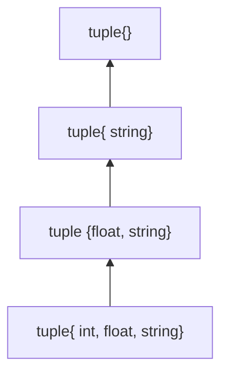

C++11到C++20的新特性解析

<!-- more -->

# C++标准介绍

优秀的c++知识库:[cppreference](https://zh.cppreference.com/w/%E9%A6%96%E9%A1%B5)

C++标准演化

- **C++98(1.0)**    正式版本
- C++03(TR1)
- **C++11(2.0)**   正式版本
- C++14
- C++17
- C++20
- C++23

[编译器对C++11的支持情况](https://zh.cppreference.com/w/cpp/compiler_support/11)

两个层面的新特性

- 语言
  - Variadic Templates
  - move Semantics
  - auto
  - Range-base for loop
  - Initializer list
  - Lambdas
  - ...
- 标准库
  - type_traits
  - unordered_set
  - forward_list
  - array
  - tuple
  - Con-currency
  - regex
  - thread
  - bitset
  - ...

## 确认支持C++标准

程序内部由下面的宏标识C++标准

```cpp
//C++11
#define __cplusplus 201103L
//C++98
#define __cplusplus 199711L
//查询C++标准库
cout<<__cplusplus<<endl;
```

# 新的基础类型

## long long类型

以及unsigned long long类型

先后在C99加入和C++11加入

由于编译器兼容C/C++,因此C++11之前C99之后也能使用该类型

- 引入新的字面量后缀(LL以及ULL)

  **LL**  : `long long x=2147483647LL+1`;(2147483647为$2^31-1$,int类型的最大值)

  编译器对字面量默认以32位进行处理,上面例子中不写LL的话,值会变成-2147483648,因此需要编译器按照64位处理字面量则需要用到`LL`,此后结果为2147483648,恢复正常

- 判断最大值最小值

  - 最大值: `std::numeric_limits<long long>::max()`
  - 最小值: `std::numeric_limits<long long>::min()`
  - 针对unsigned long long是这样:`std::numeric_limits<unsigned long long>::max()`

##  新字符类型

### char16_t/char32_t

- `char16_t`	对应UTF16   16位长度
- `char32_t`    对应UTF32   32位长度

**字符串前缀**

```cpp
char16_t utf16c=u'好';
char32_t urf32c=u'好';

char16_t utf16[]=u"你好世界";
char32_t utf32[]=u"你好世界";
```

还有两个特殊基础类型:[wchar_t](#wchar_t)和[char8_t](#char8_t)

#### u16string/u32string

`std::u16string` 和 `std::u32string` 是 C++11 引入的用于存储 UTF-16 和 UTF-32 编码的字符串的类型

### wchar_t

windows编程常用字符类型,因为windows的API大部分都有这个wchar的版本

但是该类型不常用的,原因是对于跨平台不友好,在windows上和linux上的字符长度是不确定的

对应的字符串是wstring

### char8_t

对应utf8

C++20引入的新类型

c++20之前使用char

对应的字符串类型为u8string

**字符串前缀**

```cpp
//C++20之后的标准做法
char8_t c8a[]=u8"test";
char8_t c8=u8'c';
//C++17编译成功,C++20编译失败,需要char8_t
char c8a[]=u8"test";
char c8=u8'c';
//C++20编译失败,需要字符串前缀u8
char8_t c8a[]="test";
char8_t c8='c';
```

在实际开发中，可以考虑使用现有的开源库，如 ICU（International Components for Unicode）库，它提供了丰富的 Unicode 支持，包括对不同编码的字符串操作。

[[字符编码#字符集转换|字符编码的转换参考此处]]

# bind函数

在C++中，`std::bind`函数是一个函数模板，用于创建函数对象（也称为函数符或函数器）。`std::bind`函数的主要作用是将一个可调用对象（函数、函数指针、成员函数、函数对象等）和其参数绑定在一起，形成一个新的可调用对象。这种绑定的过程可以延迟函数调用，允许我们在稍后的时间点调用这个函数对象，并传递参数。

下面是`std::bind`函数的一般用法和示例：

```cpp
#include <functional>
#include <iostream>

void printSum(int a, int b) {
    std::cout << "Sum: " << a + b << std::endl;
}

int main() {
    auto func = std::bind(printSum, 10, std::placeholders::_1);
    func(20); // 实际上调用 printSum(10, 20)

    return 0;
}
```

在这个示例中，`std::bind`函数将`printSum`函数和参数10、20绑定在一起，创建了一个新的函数对象`func`。通过调用`func()`，实际上会调用`printSum(10, 20)`函数。

`std::bind`函数的一些特点和用法包括：
- 可以绑定任意可调用对象，包括自由函数、成员函数、函数指针等。
- 可以绑定部分参数，即在创建函数对象时只传递部分参数，稍后再传递剩余的参数。
- 可以改变参数的顺序，通过占位符`std::placeholders::_1`、`std::placeholders::_2`等指定参数的位置。
- 返回的函数对象可以拷贝、移动和赋值，可以存储和延迟调用。

`std::bind`函数在C++11标准中引入，并位于`<functional>`头文件中。它是实现函数绑定和延迟调用的重要工具，可以简化代码并提高灵活性。

**实现原理**

```cpp
// 简化版的 bind 实现
template <typename Func, typename... Args>
auto my_bind(Func func, Args... args) {
    return [=](auto... moreArgs) {
        return func(args..., moreArgs...);
    };
}

void printSum(int a, int b, int c) {
    std::cout << "Sum: " << a + b + c << std::endl;
}
```

> 实际的`std::bind`函数会更加复杂，因为它支持更多的特性，如绑定成员函数、占位符、引用传递等。底层实现会涉及到更多的模板元编程技术，例如参数包展开、递归模板等。具体的实现细节可能会因不同的标准库而有所不同，但基本思想是相似的。
>
> 如果你对`std::bind`函数的底层实现原理感兴趣，可以查阅C++标准库实现的源代码，如GNU libstdc++或LLVM libc++等。这些源代码中会展示`std::bind`函数更复杂和完整的实现细节。

# 类型转换

C++11引入的针对string类型的转换函数如下:

- `int std::stoi(const std::string& str, size_t* pos = 0, int base = 10)`：将字符串转换为整数
- `long std::stol(const std::string& str, size_t* pos = 0, int base = 10)`：将字符串转换为长整数
- `long long std::stoll(const std::string& str, size_t* pos = 0, int base = 10)`：将字符串转换为长长整数
- `unsigned long std::stou(const std::string& str, size_t* pos = 0, int base = 10)`：将字符串转换为无符号长整数
- `unsigned long long std::stoull(const std::string& str, size_t* pos = 0, int base = 10)`：将字符串转换为无符号长长整数
- `float std::stof(const std::string& str, size_t* pos = 0)`：将字符串转换为单精度浮点数
- `double std::stod(const std::string& str, size_t* pos = 0)`：将字符串转换为双精度浮点数
- `long double std::stold(const std::string& str, size_t* pos = 0)`：将字符串转换为长双精度浮点数


# 确定的表达式求值顺序

 C++17才具体说明,此前由编译器确定

- 函数表达式中的参数会在函数体内的语句执行之前被求值

  ```cpp
  foo(a,b,c);//a,b,c都是表达式
  ```

  但是要注意函数的参数之间的顺序依然是不确定的

- 后缀表达式和移位运算符求值总是**从左往右**

  ```cpp
  E1[E2]
  E1.E2
  E1.*E2
  E1->*E2
  E1<<E2
  E1>>E2
  ```

- 赋值表达式求值总是**从右往左**的

  `= += -= *= /= 等等`

- new表达式的内存分配总是会优先于构造函数中参数的求值

- 重载运算符的表达式的求值顺序应由与之相应内置运算符的求值顺序确定

# 字面量优化

## 十六进制浮点字面量

`hexfloat`和`defaultfloat`

C++17引入

## 二进制整数字面量

C++14引入

前缀`0b`和`0B`

## 单引号作为整数分隔符

C++14引入,目的是让数字看起来比较好辨识  

单引号整数分隔符对于十进制,八进制,十六进制,二进制整数都是有效的

```cpp
constexpr int x = 123'456;
static_assert(x==0x1e'240);//十六进制
static_assert(x==036'11'00);//八进制
static_assert(x==0b11'110'001'001'000'000);//二进制
```

## 原生字符串字面量

C++11引入

这种字符串字面值使用`R"()"`的语法，**允许在字符串中包含特殊字符而无需转义**，方便处理包含大量转义字符的字符串。这种特性在处理正则表达式、文件路径等场景中非常有用。

> 如果字符串中包含小括号和引号的组合，可能会导致编译器对原生字符串的解析出错。为了避免这种情况，可以在原始字符串字面值的开头和结尾添加自定义的定界符，以确保编译器能够正确解析字符串。这样即使字符串中包含小括号和引号的组合，编译器也能正确识别字符串的开始和结束。  语法为: `R"自定义定界符()自定义定界符"`
>
> 以下是一个示例，演示如何在原始字符串字面值中使用自定义定界符来避免编译器解析错误：
>
> ```cpp
> #include <iostream>
> int main() {
>     const char* rawString = R"###(This is a raw string with "quotes" and (parentheses))###";
>     std::cout << rawString << std::endl;
>     return 0;
> }
> //输出为:
> //This is a raw string with "quotes" and (parentheses)
> ```
>
> 上述代码中的`###`是自定义的,可以自己想写什么写什么

## 用户自定义字面量

C++11引入

允许用户自定义字面量,只需要定义一个字面量运算符函数

基本语法:  `return_type operator"" identifier(params)`

- 双引号和identifier之间必须有空格,但改规则在C++14中被删除了
- 标准表示identifier应该以下划线`_`开始,把没有下划线的标识符保留给标准库使用

```cpp
#include <iostream>
long double operator"" _mm(long double x){return x/1000;};
long double operator"" _m(long double x){return x;};
long double operator"" _km(long double x){return x*1000;};
void main()
{
	cout<<1.0_mm<<endl;
  cout<<1.0_m<<endl;
  cout<<1.0_km<<endl;
}
//输出
//0.001
//1
//1000
```

字面量函数运算符的参数规则:

- 整形    `unsigned long long/const char*` 或者没有参数,直接拿实参作为字面量
- 浮点    `long double/const char*`或者没有参数,直接拿实参作为字面量
- 字符串   `const char*`
- 字符     `char`

# 数据对齐相关

`alignas`和`alignof`

> 首先需要先了解一下不可忽视的数据对齐问题   [[C语言入门#结构体字节对齐|结构体字节对齐(有关于设置结构体字节对齐长度的方式)]]
>
> 
>
> 内存对齐的原因是因为硬件需要,首当其冲的就是cpu.我们的cpu对数据对齐有迫切的需要(提高性能),通常来说好的数据对齐长度和cpu访问数据总线的宽度有关系.比如cpu访问32位的数据总线,就会期待数据是按照32位对齐的.另外,对于数据对齐引发错误的情况,通常发生在arm架构上(arm架构对数据对齐更严格).除了cpu外,还有其他硬件也需求硬件对齐,比如通过DMA访问硬盘,就会要求数据必须是4k对齐的

## alignof运算符

用于获取**类型**的对齐长度(不能用于对象)

> 先看看C++11之前有一些通过宏来获取类型的对齐长度(C++11之后也能用),各大厂商编译器提供了获取**类型或对象**对齐长度的函数,如:
>
> ```cpp
> //MSVC 
> auto x1=__alignof(int);
> auto x2=__alignof(void(*)());
> int a;
> cout<<__alignof(a)<<endl;
> 
> //GCC
> auto x3=__alignof__(int);
> auto x4=__alignof__(void(*)());
> int a;
> cout<<__alignof__(a)<<endl;
> ```
>
> 因此C++11标准引入alignof统一了用法

**使用案例**

```cpp
auto x1=alignof(int);
auto x2=alignof(void(*)());
```

注意:**`alignof`只能处理类型,不能处理对象**,即使使用decltype获得类型也不准确,因为使用**decltype获取的类型是默认对齐长度的类型**.因此这种情况还是需要使用编译器厂商提供的方法

## alignas说明符

用于设置**类型或者常量表达式**的对齐长度

> 先看看C++11之前各大编译器提供的设置对齐长度的方法(C++11之后也能用),例如:
>
> ```cpp
> //MSVC
> short x1;
> __declspec(align(8)) short x2;
> cout<<__alignof(x1)<<endl;
> cout<<__alignof(x2)<<endl;
> 
> //GCC
> short x3;
> __attribute__((aligned(8))) short x4;
> cout<<__alignof(x3)<<endl;
> cout<<__alignof(x4)<<endl;
> 
> //输出均为:
> //2
> //8
> ```

规则:

- 如果将alignas用于结构体,该结构体整体就会以该数值来对齐结构体
- 如果修改结构体成员的对齐长度,那么结构体整体的对齐长度也会发生变化,因为结构体整体的对齐长度总是大于或等于他最大的成员的对齐长度

**使用案例**

```cpp
//结构体大小: 16   结构体对齐长度: 8
struct X{
	char a1;//1
  int a2;//4
  //3
  double a3;//8
};

//结构体大小: 32   结构体对齐长度: 16
struct X1{
	alignas(16) char a1;//16
  alignas(double) int a2;//8
  double a3;//8
};

//结构体大小: 16   结构体对齐长度: 16
struct alignas(16) X2{
	char a1;//1
  int a2;//4
  //3
  double a3;//8
};

//结构体大小: 32   结构体对齐长度: 16
struct alignas(16) X3{
  alignas(8) char a1;//8
  alignas(double) int a2;//8
  double a3;//8
  //8
};

//编译错误
struct alignas(4) X4{//对齐不能设置为小于默认对齐
  alignas(8) char a1;
  alignas(double) int a2;
  double a3;
}
```

标准库也提供了一些方法

## 其他关于对齐字节长度的支持

C++11引入

- `alignment_of`

  获取类型的对齐字节长度

- `aligned_storage`

  分配一块指定对齐字节长度和大小的内存

- `aligned_union`

  获取参数类型中对齐字节长度最严格的(对齐字节数最大)作为分配内存的对齐字节长度

## 使用new分配指定对齐长度的对象

C++17支持new分配指定对齐长度的对象

new运算符接受一个`align_val_t`类型的参数来获得分配对象需要的对齐字节长度

```cpp
//new运算符的声明发生了变化
void* operator new(size_t,align_val_t);
void* operator new[](size_t,align_val_t);
//align_val_t是由编译器自动填充的,程序员不需要关心
```

# 属性说明符和标准属性

## 属性说明符

C++11之前,GCC和MSVC提供的属性语法:

```cpp
//GCC
__attribute__((attribute-list))
  
//MSVC
__declspec(attribute_list)
```

C++11引入了属性说明符语法，C++17进一步扩展了这一特性

```cpp
//基本语法
[[attr]] 
[[attr1,attr2,attr3(args)]] //需要多个属性时
[[namespace::attr(args)]]//指定命名空间

//简易例子
[[attr1]] class 
[[attr2]] X {int i;} 
a,b[[attr3]];
```

**基本规则**

属性可以出现在整个声明之前,或者直接更在被声明的对象之后,组合起来的规则为:

**属性说明符总是声明位于其之前的对象,而在整个声明之前的属性,则会声明语句中所有声明的对象**

效果为: 若程序不符合属性要求,编译器将会发出警告

## 使用using打开属性的命名空间

C++17引入

```cpp
//有命名空间的情况
[[gnu::always_inline,gnu::hot,gnu::const,nodiscard]] inline int f();
	//或
[[gnu::always_inline]][[gnu::hot]][[gnu::const]][[nodiscard]] inline int f();
//使用using
[[using gnu:always_inline,hot,const]][[nodiscard]] inline int f();
```

## 标准属性

- [noreturn](#noreturn): 声明函数不会返回
- [carries_dependency](#carries_dependency): 允许跨函数传递内存依赖项
- [deprecated](#deprecated): 标记实体为弃用
- [fallthrough](#fallthrough): 在switch语句中提示编译器直落行为是故意的
- [nodiscard](#nodiscard): 声明函数的返回值不应该被舍弃
- [maybe_unused](#maybe_unused): 声明实体可能不会被使用
- [likely/unlikely](#likely/unlikely): 表示某条路径更加有可能或没可能，用于优化,通常用于switch语句
- [no_unique_address](#no_unique_address): 指示数据成员不需要唯一地址
- 等等

### noreturn

声明函数不会返回

```cpp
[[noreturn]] void foo(){}
```

### carries_dependency

允许跨函数传递内存依赖项,它通常用于弱内存顺序架构平台上多线程程序优化,避免编译器生成不必要的内存栅栏指令

powerPC微处理器架构属于弱内存顺序架构平台,Intel和amd的x86和x64处理器系列不属于

### deprecated

带有此属性实体被声明为**弃用**

```cpp
[[deprecated]] void foo(){}
class [[deprecated]] X{};
```

如果使用弃用的实体,编译会给出系统警告: `deprecated("xxx was deprecated")`

### fallthrough

C++17中引入:在switch语句的上下文中提示编译器直落行为是故意的

```cpp
void bar(){}
void foo(int a){
  switch(a){
    case 0:break;
    case 1:
      bar();
      [[fallthrough]];
    case 2:
      bar();
      break;
    default: break;
  }
}
```

### nodiscard

声明函数的返回值不应该被舍弃

可以声明在函数或类或枚举类型上,但是声明到类或枚举类型上时只有被当成函数的返回值时才会生效

```cpp
class [[nodiscar]] X{};
[[nodiscard]] int foo() {return 1;}
x bar() {return X();};//使用该函数时如果不处理返回值将被警告
```

### maybe_unused

C++17引入,声明实体可能不会被使用

```cpp
int foo(int a[[maybe_unused]],int b[[maybe_unused]])
{
  return 5;
}
```

### likely/unlikely

C++20引入的,通常用于switch语句中,表示某条路径更加有可能或没可能让编译器可以进行优化

- 声明在标签或语句上
- likely属性允许编译器对该属性所在的执行路径相对于其他执行路径更可能的进行优化
- unlikely允许编译器对该属性所在的执行路径相对于其他执行路径更不可能的进行优化

### no_unique_address

C++20引入,指示编译器该数据成员不需要唯一地址

通常用于数据成员类型只有成员函数,没有成员变量的类型

```cpp
struct Empty{};
struct X{
  int i;
  [[no_unique_address]] Empty e;
};

X x;
cout<<sizeof(x)<<endl;
cout<<&((X*)0)->i<<endl;
cout<<&((X*)0)->e<<endl;
//不加[[no_unique_address]]结果为:
//8
//0
//4
//加[[no_unique_address]]结果为:
//4
//0
//0
```

# 新增预处理器功能和宏

## 头文件可用宏

`__has_include(<头文件>)`

判断某个头文件是否能被包含进来(注意他不关心头文件是否已经被导入)

```cpp
#if __has_include(<optional>)
	#include<optional>
	#define have_optional 1
#elif __has_include(<experimental/optional>)
	#include<experimental/optional>
	#define have_optional 1
	#define experimental_optional 1
#else
	#define have_optional 0
#endif
```

## 特性测试宏

对于代码库的作者,因为有了特性测试宏,可以根据客户端开发环境适配不同的代码功能,让自己的代码库能更高效的使用在更多的环境上

### 属性测试运算宏

`__has_cpp_attribute(属性);`

指示编译器是否支持某种属性,该属性可以是标准属性,也可以是编译器特有的属性,前者展开为属性添加进标准的年份与月份,后者展开为非零值

### 语言功能特性测试宏


如果支持,将展开为引入特性的年月

### 标准库功能特性测试宏


## 参数不为空宏

`__VA_OPT__`

c+20引入

可变参数不为空时才展开

```cpp
//可变参数宏的问题:打印案例
#define LOG(msg, ...) printf("[" __FILE__ ":%d]" msg,__LINE__,__VA_ARGS__)
LOG("Hello 2020");
//展开后有问题,多了一个逗号
printf("[" __FILE__ ":%d]" "Hello 2020",__LINE__,);

//可变参数不为空时才展开__VA_OPT__
#define LOG(msg, ...) printf("[" __FILE__ ":%d]" msg,__LINE__ __VA_OPT__(,) __VA_ARGS__)
```

# 协程

协程是一种可以被挂起和恢复的函数,它提供了一种创建异步代码的方法

基于MSVC的await编译选项进行讲解

- 拓展了标准库,提供了一些辅助库

下面代码使用了微软协程库的特性 co_await 


# 命名空间相关

C++17引入内联命名空间与嵌套命名空间

## 内联命名空间

把子命名空间的元素导入到父命名空间中

注意: inline这个关键字不能用到第一层的命名空间中

```cpp
namespace Parent{
  namespace Child1{
    void foo(){cout<<"Child1::foo()"<<endl;
  }
	inline namespace Child2{
  		void foo(){ cout<<"Child2::foo()" <<endl;
  }
}
int main(){
	Parent::Child1::foo();
	Parent::foo();//调用的是Child2中的foo
}
```

> **主要作用** : **方便库的开发者管理代码,升级代码后无缝地提供给使用者.**当我们想去修改升级这个函数的时候,版本1换成版本2,最好的方式就是使用**内联命名空间**,本来inline是在版本1的namespace的,只需要将inline关键字转移到版本2的namespace上,则达成修改,其他代码无需修改,并且保留了原始版本代码

## 嵌套命名空间

主要是用来**减少命名空间带来的代码冗余**

```cpp
namespace A::B::C {
  int foo(){return  5;}
}
//这种方式是A嵌套的B嵌套的C命名空间中定义了一个foo函数
```

## 嵌套内联命名空间

**C++20**才支持

```cpp
namespace A::B{
  inline  namespace C{
    int foo(){return 5;}
  }
}
//等同于
namespace A::B::inline C{
  int foo(){return 5;}s
}
```

# 拓展的inline说明符

## 内联变量

C++17引入了内联变量

> 在C++中，内联变量是指使用`inline`关键字声明的变量。使用`inline`关键字声明的变量会被视为内联变量，编译器会尝试将其直接嵌入到调用它的地方，而不是分配内存空间给该变量。这样可以减少函数调用的开销，提高程序的执行效率。需要注意的是，内联变量的定义必须在所有使用该变量的地方可见，否则会导致链接错误。

[[C++基础#内联函数(inline function)|内联变量知识点跳转]]

除了[内联命名空间与嵌套命名空间](#命名空间相关)中对inline的新拓展外,inline还拓展了用于定义非常量静态成员变量的用法

## 内联非常量静态成员变量

非常量静态成员变量的问题:声明和定义必须分开,即定义必须在类外

```cpp
class X{
public:
  static string text;
};
string X::text{"hello"};//定义在类外
```

> 常量静态数据成员可以一次性完成声明和定义
>
> ```cpp
> class X{
> public:
>   static const int num{5};
> };
> ```

从C++17开始标准引入了内联定义静态数据成员的方式:解决了C++中定义静态成员变量繁琐的问题

```cpp
//基本语法
class X{
public:
  	inline static string text{"hello"};
};
```

> 即使将类X的定义作为头文件包含在多个源文件中也不会有任何问题
>
> 让编译器可以聪明的选择首次出现的变量进行定义和初始化,这种特性符合inline说明符提案文档中的一句话:inline说明符可以应用于变量和函数.声明为内联的变量和函数具有相同的语义,他们一方面可以在多个翻译单元中定义,另一方面又必须在每个使用他的翻译单元中定义,并且行为就像同一个变量

# 函数返回类型后置

基本语法:


一般用于推导函数模板返回类型

```cpp
auto test(int a,int b)->int
{
  return a+b;
}
```

# 默认实参

[参考](https://zhuanlan.zhihu.com/p/588948013)

- 默认实参可以不写参数名
- 默认实参在声明中可传递(可能有点绕,看下面解释)
- [形参包](可变参数模板)前可以直接写默认实参
- 

C++11版本引入了函数的**默认实参可以不写参数名**的特性。`void f(int=3);`

在函数声明中，所有在拥有默认实参的形参**之后的形参**必须拥有**在这个或同一作用域中先前的声明中所提供的默认实参。你可能觉得很绕，其实说白了就是说，你可以给任何形参默认实参，但是，你需要在当前作用域提前给你已经声明了默认实参的形参后面的形参默认实参。比如:**

```cpp
void f(int, int, int = 10);
void f(int, int=6, int);
void f(int = 4,int,int);
void f(int a, int b, int c) { std::cout << a << ' ' << b << ' ' << c << '\n'; }
int main(){
    f();//4 6 10
}
```

除非该形参是从某个形参包展开得到的或是函数形参包,如:

```cpp
template<class...Args>
void f_(int n = 6, Args...args) {//没错
}
```

还有很多点,略,详情点击[参考](https://zhuanlan.zhihu.com/p/588948013)

# 右值引用

> C++11提出的一个非常重要的概念,它的出现不仅完善了C++的语法,改善了C++在数据转移时的执行效率(减少了非必要复制),同时还增强了c++的模板能力
>
> c++11中对C++影响最深远的特性就是**右值引用**

首先区分左值和右值

- 判断对象能否取地址  可以取地址的为左值,不可以取地址的为右值
- 所谓的左值一般是指一个指向特定内存具有名称的值(具名对象),它有一个相对稳定的内存地址,并且有一段较长的生命周期.而右值则是不指向稳定内存的地址匿名值(不具名对象),它的生命周期很短,通常都是暂时性的

简单区分:

```cpp
int a=9;
int b=4;
a+b=42;//[Error]
//此处的a+b为右值

string s1("Hello");
string s2("World");
s1+s2=s2;//竟然通过编译,但没什么意义
cout<<s1<<endl;//输出:Hello
cout<<s2<<endl;//输出:World
string()="World";//竟然可以对临时对象赋值,但没什么意义
//临时对象也是右值
```

------

```cpp
//原本对右值不能取reference
int foo(){return 5;}
int *p=&foo();//编译错误,可以理解为想取foo返回的东西的地址
foo()=7;//编译错误
```

当右值出现于赋值运算符右侧时,我们认为对其资源进行偷取/搬移(move),而非拷贝(copy)是合理的

因此

1. 必须有语法让我们在**调用端**告诉编译器,这是个右值
2. 必须有语法让我们在**被调用端**写出一个专门处理右值的所谓移动构造函数

于是乎,引入了**右值引用**

## 左值引用和右值引用

- 常量左值引用

  ```cpp
  int &x1 = 7;//编译错误
  const int &x1 = 11;//编译成功
  ```

- 右值引用语法

  ```cpp
  int &&k = 11; 
  ```

右值引用引入了[移动语义](#移动语义)

### 值类别

- 分为2种: 泛左值(glvalue)和右值(rvalue)

  泛左值: 通过计算评估能够确定对象位域或函数的标识的表达式(简单理解就是具名对象)

- 分为3种: 左值,纯右值和将亡值

  纯右值: 通过计算评估,能够用于初始化对象和位域或者能够计算运算符操作数的值的表达式(简单理解为是为了初始化其他对象的)

  将亡值: 资源可以被重用的对象和位域,通常是因为它们接近生命周期的末尾,另外也有可能是经过右值引用的转换产生的


- 左值和将亡值统称为泛左值	
- 纯右值和将亡值统称为右值

### 左值转换为右值

#### 基本的转换方式

```cpp
int i=0;
int &&k1=i;	//编译失败
int &&k2=static_cast<int&&>i;	//编译成功
```

#### 使用std::move

[move函数详解](#move函数)  

```cpp
static_cast<remove_reference<decltype(arg)>::type&&>(arg)
  //与使用move函数效果一致
move(arg)
```

> `remove_reference<>`：`remove_reference` 是一个模板元函数，是 C++11 标准引入的一个类型转换工具，位于 `<type_traits>` 头文件中,用于移除参数类型的引用修饰符。例如，如果 `arg` 的类型是 `int&`，`remove_reference<int&>::type` 将返回 `int`

## 移动语义

> 当一个右值复制
>
> 拷贝构造的时候,若被拷贝对象是一个右值或者是一个临时对象的时候,原本的做法非常不聪明.更高效的做法是将马上要被销毁的临时对象的资源内容移动到目标对象中

### move函数

`std::move` 是一个函数，其主要目的是将**任何类型的变量无条件地转化为右值**。

- 用于实现**移动语义**，减少不必要的拷贝开销和内存开销。
- 例如，将一个左值传入 `push_back` 时，可以使用 `std::move` 来实现真正的转移，避免额外的拷贝操作：

```cpp
std::vector<std::string> vec;
std::string x = "abcd";
vec.push_back(std::move(x));//用move可以理解为x的资源将被"偷"取
```

有个问题是move函数的原理

> 学习的时候,可以利用:`-fno-elide-constructors`是一个编译 选项，用于告诉编译器不要优化构造函数。通常情况下，编译器会尝试对构造函数进行优化，例如通过返回值优化（Return Value Optimization）来避免不必要的拷贝操作。使用该选项可以禁用这种优化，强制执行构造函数的拷贝操作。这在某些情况下可能有用，例如在调试时需要确保每次构造函数都被调用。

通过观察发现:移动语义可以将函数中的局部变量返回出来,观察汇编代码会发现,实际上根本没有进入到函数内,而是在进入函数前就定义了局部变量.意思就是本应在最里层的局部变量定义到了外面,这样当然就可以返回了

### 移动构造函数以及移动赋值运算符函数

C++的类中因此新增的默认函数:

- 移动构造函数
- 移动赋值运算符函数

```cpp
myClass(myClass&& other) noexcept{}//移动构造函数
myClass& operator=(const myClass&& other) noexcept{}//移动赋值运算符函数
{
	//...
  return *this;
}
```

[可以参考这个链接查看汇编](https://godbolt.org/z/h3x8dnT17)


第一个图是浅拷贝流程,中间的图是原来的深拷贝流程,右图是移动流程,即**偷**(一个生动形象的动词,注意打断了原本对象和空间的联系)

加入了移动语义的类中,**编译器隐式声明的特殊成员图**一览:


规则总结:

- 默认构造,析构,赋值拷贝,赋值移动,拷贝构造,拷贝移动默认都会自动由编译器生成
- **用户定义了任何构造函数,则默认构造函数不会自动生成**
- 用户定义了拷贝构造和拷贝赋值函数或析构函数任一,则移动语义两个函数不会自动生成
- 用户定义了移动语义两个函数任一,则复制语义两个函数不会自动生成

**非常重要的一点**: 只要是使用了构造函数,即使是使用的移动构造函数,也会在该对象生命周期结束的时候,自动调用析构函数(根据调用的构造函数的次数来决定)

> 一个使用移动构造函数的例子:(注意调用了两次析构函数)
>
> **一个案例**
>
> ```cpp
> #include <iostream>
> 
> class MyObject {
> private:
>     int* data;
> 
> public:
>     MyObject() : data(nullptr) {
>         std::cout << "Default Constructor" << std::endl;
>     }
> 
>     MyObject(int value) : data(new int(value)) {
>         std::cout << "Regular Constructor" << std::endl;
>     }
> 
>     // 移动构造函数
>     MyObject(MyObject&& other)noexcept : data(other.data) {
>         other.data = nullptr;
>         std::cout << "Move Constructor" << std::endl;
>     }
> 
>   	// 移动赋值操作符
>     MyObject& operator=(MyObject&& other) noexcept {
>         if (this != &other) {
>             delete data;
>             data = other.data;
>             other.data = nullptr;
>         }
>         std::cout << "Move Assignment Operator" << std::endl;
>         return *this;
>     }
>   
>     ~MyObject() {
>         delete data;
>         std::cout << "Destructor" << std::endl;
>     }
> 
>     void printData() const {
>         if (data != nullptr) {
>             std::cout << "Data: " << *data << std::endl;
>         } else {
>             std::cout << "Data is null" << std::endl;
>         }
>     }
> };
> 
> int main() {
>     MyObject obj1(10);
>     obj1.printData();
> 
>     MyObject obj2(std::move(obj1));  // 使用std::move调用移动构造函数
>     obj2.printData();
>     
>     obj1.printData();  // obj1的data现在为null
> 
>     return 0;
> }
> /*
> Regular Constructor
> Data: 10
> Move Constructor
> Data: 10
> Data is null
> Destructor          <--调用了两次析构函数
> Destructor
> */
> ```

## 万能引用

**万能引用**是针对**模板**而来的

常量左值引用既可以引用左值又可以引用右值,是一个几乎万能的引用,但可惜由于其常量性,导致它的使用范围收到一些限制.因此此处介绍的万能引用是真正意义上的"万能"的引用

[右值引用](#右值引用)  --模板->  万能引用:

- 具体类型的&&符号表示右值引用

- 模板的&&符号表示[万能引用](#万能引用)

> 所谓的万能引用是因为发生了类型推导，在T&&和auto&&的初始化过程中都会发生类型的推导，如果已经有一个确定的类型，比如int &&，则是右值引用。在这个推导过程中，初始化的源对象如果是一个左值，则目标对象会推导出左值引用；反之如果源对象是一个右值，则会推导出右值引用，不过无论如何都会是一个引用类型。
> 万能引用能如此灵活地引用对象，实际上是因为在C++11中添加了一套引用叠加推导的规则——[引用折叠](#万能引用的规则)。在这套规则中规定了在不同的引用类型互相作用的情况下应该如何推导出最终类型

```cpp
void foo(int &&i){}//i为右值引用

template<class T>
void bar(T &&t){}  //t为万能引用

int &&x=get_val();//x为右值引用

auto &&y=get_val();//y为万能引用
```

万能引用既可以是一个左值引用,也可以是一个右值引用,这个能力是通过模板形参的推导完成的

万能引用最重要的一个应用是[完美转发](#完美转发)

### 万能引用的规则

万能引用使用了一套叫做**引用折叠**的规则,即不同引用类型叠加后的推导结果

| 类模板型 | T实际类型 | 最终类型 |
| -------- | --------- | -------- |
| T&       | R         | R&       |
| T&       | R&        | R&       |
| T&       | R&&       | R&       |
| T&&      | R         | R&&      |
| T&&      | R&        | R&       |
| T&&      | R&&       | R&&      |

- 类模板型和T实际类型均有引用符,则按照数量少的引用符确定最终类型
- 类模板型和T实际类型有一个有引用符,则按照有引用符的数量来确定最终类型

或者另一个记忆方式:(按照优先级来罗列)

1. 有左值引用,则最终类型为左值引用(优先级最高)
2. 有右值引用,则最终类型为右值引用

值得一提的是万能引用的形式必须是`T&&`或者`auto&&`,而不能是`vector<T>&&`,必须在初始化的时候被直接推导出来,若在推导中出现中间过程,则不是一个万能引用

### 完美转发

> 为了解决在函数模板中传递参数时保持参数的值类别（lvalue 或 rvalue）不变的问题

```cpp
//下面三种方式都不是完美转发,都有各自的问题:
//执行过程中会执行构造函数,因为是按值转发,即在转发过程中会额外发生一次临时对象的复制
template<class T>
void normal_forwarding1(T t)
{
	show_type(t);
}

//解决了上面效率的问题,但是不能转发右值
template<class T>
void normal_forwarding2(T &t)
{
  show_type(t);
}

//能转发右值了,但是即使传左值也无法修改了
template<class T>
void normal_forwarding3(const T &t)
{
  show_type(t);
}
```

**完美转发**

原来是左值,转发后也是左值;原来是右值,转发后也是右值

```cpp
template<class T>
void perfect_forwarding(T &&t)
{
  //t传入的是左值的话,在此处会和右值折叠还是左值
  //t传入的是右值的话,在此处会和右值折叠还是右值
  show_type(static_cast<T&&>(t));//这里必须是T&&,因为只有T&&可以推导出右值
}
//显示使用static_cast类型转换进行转发不是一个便携的方法.在C++11的标准库中提供了一个std::forward函数模板,在函数内部也是使用static_cast进行类型转化
//使用forward转发语义会表达得更加清晰
template<class T>
void perfect_forwarding(T &&t)
{
  show_type(std::forward<T>(t));
}
```

- `std::forward` 用于在模板函数中**完美转发**参数。
- 它有条件地将变量转化为右值，只有当输入的变量是右值时，才会将其转化为右值引用；如果输入的变量是左值，那么 `forward` 将输入的变量转化成左值。
- 通常用于保留原始变量的左值和右值属性。

## 自定义支持移动的类

完整写法参考

```cpp
class MyString{
    char* p;
    int length;//字符数
public:
    MyString() = default;
    MyString(char *cs){
        length = strlen(cs);
        p = new char[length+1];
        memcpy(p, cs, length + 1);
        cout << "构造函数,构造指针地址为"<<(void*)p << endl;
    };
    MyString(const MyString &other) : length(other.length)
    {
        p = new char[length + 1];
        // 使用c++17引入的std::copy_n复制字符串内容
        std::copy_n(other.p, length + 1, p);
        cout << "拷贝构造函数,构造指针地址为"<<(void*)p << endl;
    }
    MyString &operator=(const MyString &other) 
    {
        // 先检查是否自我赋值，如果是则直接返回*this
        if (this == &other)
        {
            return *this;
        }
        // 释放原有内存
        delete[] p;
        // 分配新的字符数组以存储复制的字符串内容，并包含一个空终止符的位置
        length = other.length;
        p = new char[length + 1];

        // 使用std::copy_n复制字符串内容，不包括空终止符
        std::copy_n(other.p, length+1, p);

        cout << "赋值构造函数,构造指针地址为"<<(void*)p << endl;
        return *this; // 返回当前对象的引用
    }
    MyString(MyString && other) noexcept:p(other.p),length(other.length)//转移所有权
    {
        cout << "移动构造" << endl;
        other.p=nullptr;
        other.length=0;
    }
    MyString &operator=(MyString && other)noexcept//转移所有权
    {
        if(this!=&other)//自我赋值检查
        {
            if(p){delete[] p;p=nullptr;}
            length = other.length;
            p=other.p;
            other.p=nullptr;//切断与先前的联系
            other.length=0;
        }
        cout << "移动赋值运算符" << endl;
        return *this;
    }
    virtual ~MyString()
    {
        if(p)
        {
            cout<<"析构成功函数,释放地址为:"<<(void*)p<<endl;
            delete[] p;
            p=nullptr;
        }
        else
        {
            cout<<"经过析构函数"<<endl;
        }
    }
    friend std::ostream& operator<<(std::ostream& os, const MyString& str) {
        os <<  str.p;
        return os;
    }
};
//==========================
//测试如下:
MyString s("hello");
MyString s2=s;
cout<<s2<<endl;
return 0;
//输出如下:
构造函数,构造指针地址为0x13a605ea0
拷贝构造函数,构造指针地址为0x13a605d30
hello
析构成功函数,释放地址为:0x13a605d30
析构成功函数,释放地址为:0x13a605ea0
//==========================
//测试2如下:
MyString s("hello");
MyString s2=move(s);
cout<<s2<<endl;
return 0;
//输出如下:
构造函数,构造指针地址为0x140f041b0
移动构造
hello
析构成功函数,释放地址为:0x140f041b0
经过析构函数
```

# 非静态成员默认初始化

 从C++11开始,声明**非静态数据成员**的同时,可以直接对其使用**等号或大括号进行初始化**

> 以前只有类型为整形或者枚举类型的常量静态数据成员才可以进行这种默认初始化

```cpp
class X{
 int a =0 ;
 double b{0};
 string c{"hello world"};
}
```

另外从C++20开始,允许我们对数据成员的[[C++基础#位域|位域]]进行默认初始化了

```cpp
struct S{
 int y:8=11; 
 int z:4{7};
}
```

# 可变参数模板

**Variadic Templates**

[[C++基础#模板|基础模板知识点参阅]]

关键词: `...`

`...`就是一个所谓的pack(包)

- 用于模版参数就是模版参数包
- 用于函数参数类型就是函数参数类型包
- 用于函数参数就是函数参数包

> 使用这种语法能兼容两个变化点,模板参数的两个点:
>
> - 参数个数(variable number)
>
>   本质是利用参数个数逐一递减的特性,实现递归函数调用.使用函数模板完成
>
> - 参数类型(different type)
>
>   本质是利用参数个数逐一递减导致参数类型也逐一递减的的特性,实现递归继承或递归复合,使用类模板完成

> 设计函数的时候
>
> - 当希望函数参数是类型不同,个数也不同的时候,采用可变参数模板
>
> - 当希望函数参数只有个数不同,类型相同的时候,可以采用[initializer_list](#一致性初始化),但是调用的时候需要多写一对`{}`
>
>   这种情况也可以使用可变参数模板,只需要在定义 参数为[1+包]的函数时,使第一个参数的类型固定,而不是模板类型.

## 函数案例 

针对下面的情况:

```cpp
void print()
{}

template <typename T,typename... Types>
void print(const T& firstArg,const Types&... args)
{
  cout<<firstArg<<endl;
  print(args...);
}
```

args可以为任意数量(包含0个)的参数,并且每个参数可以是任何类型的(args为一包类型的一包参数)

`sizeof...(args)`用于**查看包中的个数**

但print函数的参数为0个时,因为0个参数没办法拆分为1+0,所以会走`void print()`,即作为递归的终止条件

更复杂的版本:

```cpp
//要求是传入什么类型就输出什么类型,用%符号来占位,%%表示%本身
void myPrint(const char* s)
{
    while(*s)
    {
        cout<<*s++;
    }
}

template<typename T,typename... Ts>
void myPrint(const char* s,T first,Ts... others)
{
    while(*s)
    {
        if(*s=='%'&&*(s+1)!='%')
        {
            //找到占位符
            cout<<first;
            //退出前继续打印接下来的
            myPrint(++s,others...);//++s跳过百分比符号
            return;
        }
        else if(*s=='%'&&*(s+1)=='%')
        {
            cout<<'%';
            s+=2;
        }
        else
            cout<<*s++;
    }
}
```

## 类案例

> 下面的案例是tuple(元组),tuple可以任意指定多个不同类型的成员,构造出一个对象
>

### 递归继承

> 实现方式是通过[可变参数模板](#可变参数模板)实现的**递归继承**
>
> 流程可描述为:将tuple类模板的类型分为[1+一包],先定义一个类型为第一个参数的类型,使该类继承自类型为[一包]的类型的类.(下方代码下面有贴继承链)

```cpp
//下面案例是元组
template<typename... Values> class tuple;//模板的声明，用于告诉编译器有一个名为`tuple`的模板类存在，但具体的实现将在后面的代码中提供

template<> 
class tuple<> {};//作为终止条件的空类

template<typename Head,typename... Tail>
class tuple<Head,Tail...>:private tuple<Tail...>//递归继承
{
  //定义tuple的继承类型
	typedef tuple<Tail...> inherited;
public:
  //构造函数
  tuple(){}
  tuple(Head v,Tail... vtail):m_head(v),inherited(vtail...)//初始化列表,inherited(vtail...)表示调用父类的构造函数
  {}
  //定义函数head
  Head head() {return m_head;}
  //C++14前也可以写成这种声明方法(返回类型后置写法):auto head() -> decltype(m_head) { return m_head; }
  //定义函数tail
  inherited& tail() {return *this;}//return后转型为inherited,这是一个巧妙的函数,通过该函数作为桥梁用于访问所有元素
protected:
  //定义成员变量m_head
  Head m_head;
};
```

参照如下的继承链理解:(下图使用 `{}` 代替 `<>`) (`a->b`表示a继承b)



使用上面案例的情况如下:

```cpp
tuple<int,float,string> t(41,6.3,"nico");
t.head();   //-->获得41
t.tail().head();  //-->获得6.3
t.tail().tail().head();   //-->获得"nico"
```

### 递归复合

层层复合

```cpp
// 下面案例是元组
template <typename... Values>
class tuple; // 模板的声明，用于告诉编译器有一个名为`tuple`的模板类存在，但具体的实现将在后面的代码中提供

template <>
class tuple<>
{
}; // 作为终止条件的空类

template <typename Head, typename... Tail>
class tuple<Head, Tail...>
{
    // 定义tuple的继承类型
    typedef tuple<Tail...> composited;

public:
    // 构造函数
    tuple() {}
    tuple(Head v, Tail... vtail) : m_head(v), m_tail(vtail...) // 初始化列表,inherited(vtail...)表示调用父类的构造函数
    {
    }
    // 定义函数head
    Head head() { return m_head; }
    // C++14前也可以写成这种声明方法(返回类型后置写法):auto head() -> decltype(m_head) { return m_head; }
    // 定义函数tail
    composited& tail() { return m_tail; } // return后转型为inherited,这是一个巧妙的函数,通过该函数作为桥梁用于访问所有元素
protected:
    // 定义成员变量m_head
    Head m_head;
    composited m_tail;
};
```

如下图罗列了每个类型的成员变量类型,层层组合关系


## 并存问题

```cpp
template <typename T,typename... Types>
void print(const T& firstArg,const Types&... args)

template <typename... Types>
void print(const Types&... args)
```

上面这种情况参数为[1+包]和[包]的两个重载函数可以并存

注意:当调用print函数传入多个参数时,**参数为[1+包] 比 [包] 更特化**,调用的是[1+包]那个函数,即 `void print(const T& firstArg,const Types&... args)`.因此当他们共同存在的时候,参数为[包]的函数就永远不会被调用到了.

可变参数模版的作用:1.递归

# 模版表达式中的空格

```cpp
vector<list<int> >;    //每个C++版本的都支持
vecot<list<int>>;    //从C++11开始支持
```

# nullptr

> nullptr是C++11引入的空指针常量用于代替NULL或者0赋值给空指针
>
> 是一个nullptr_t类型的纯右值

例子如下:

```cpp
//有两个函数
void f(int);
void f(void*);
//调用哪个函数?
f(0);				//调用f(int)
f(NULL);    //调用f(int)
f(nullptr); //调用f(void*)
```

## nullptr_t

顾名思义,**nullptr的类型**

`typedef decltype（nullptr）nullptr_t；`

`nullptr_t`是一个与 `nullptr` 具有相同类型的类型。

用处:为了在代码中使用更具有语义的类型,例如:可以使用 `nullptr_t` 来声明接受空指针的函数参数或返回类型，以增加代码的清晰度和可读性。

# 三向比较

在C++20中引入了太空船运算符`<=>`，它是一种三向比较运算符，用于比较两个值。这个运算符返回一个特殊的值，表示两个值之间的关系。这个值可以是负整数、零或正整数，分别表示第一个值小于、等于或大于第二个值。 太空船运算符的语法如下：

```ini
result = expression1 <=> expression2;
```

其中，result的值为： 

- 负整数：如果expression1小于expression2。
- 零：如果expression1等于expression2。 
- 正整数：如果expression1大于expression2。 

这个运算符对于排序和比较操作非常有用，可以简化代码并提高可读性。

注意:运算符`<=>`的返回值只能与0和自身类型来比较,如果同其他数值比较,编译器会报错

```cpp
bool=7<=>11<0;//编译成功,b为true
bool b=7<=>11<100;//变异失败,<=>的结果不能与除0以外的数值比较
```

## 返回类型

`<=>`运算符的返回值有三种类型

1. strong_ordering      严格相等:相等并且可替换算相等
2. weak_ordering       非严格相等:相等但不可替换算相等,比如大小写不同的字符串
3. partial_ordering	 非严格相等:相等但不可替换算相等,多了一个可以毫无比较关系的选项

## 对基础类型的支持

1. 对两个算数类型的操作数,对各操作数进行一般算术转换,然后进行比较,其中整形的比较结果为`strong_ordering`,浮点型的比较结果为`partial_ordering`
2. 对于两个底层类型不同的枚举类型,则无法编译
3. 对于其中一个操作数为bool类型的情况,另外一个操作数必须也是bool类型,否则无法编译,比较结果为`strong_ordering`
4. 不支持比较的两个操作数为数组的情况,会导致编译错误
5. 对于其中一个操作数为指针类型的情况,需要另一个操作数是同样类型的指针,或者是可以转换为相同类型的指针,最终比较结果为`strong_ordering`

## 自动生成比较函数

**C++20规定,当用户为自定义类型声明了三向比较运算符,那么编译器会为其自动生成`<,>,<=,>=`四种运算符函数，减少了开发者的工作量** 

**用户自定义类型中,如果实现了`<,==`运算符函数,该类的三向比较中将自动生成合适的比较代码**

```cpp
strong_ordering operator<=>(const MyType&) const=default;
```

# auto关键字

**auto**表示任意类型

声明变量时根据初始化表达式自动推断该变量的类型,声明函数时函数返回值的占位符

> auto一大用处是当类型非常长或非常复杂的时候使用,合理使用auto可以减少代码冗余

```cpp
//非常长,如:iterator
vector<string> v;
//vector<int>::iterator pos = v.begin();
auto pos=v.begin();

//非常复杂,如:lambda
auto l=[](int x)->bool{
  //...
};
```

## **auto关键字的特性**

- 从左往右的推导

  ```cpp
  auto x=1,y=4.2;
  //从左往右x会先被推导为int类型,因此后半段会报错;
  ```

- 使用表达能力更强的类型

  ```cpp
  //此处会推导出x的类型为double而不是int类型,虽然这里的条件表达式最终返回的是1
  auto x=true?1:4.2;
  static_assert(std::is_same<decltype(x),double>::value);
  ```

- **不能声明非静态成员变量**

- **C++20之前无法声明形参**

## 推导规则

- 按值初始化

  忽略CV限定符,即const和volatile两种

  ```cpp
  const int i = 5;
  auto j = i;
  //推导出j为int类型
  ```

- 按引用初始化

  忽略引用

  ```cpp
  int i =5;
  int &j=i;
  auto m=j;
  //m是int类型
  ```

- 万能引用

  ```cpp
  int i =5;
  auto&& m=i;
  auto&& j=5;
  //auto推导为int类型,j为int&&
  ```

- 数组或者函数

  会推导为指向相应类型的指针

  ```cpp
  int i[5];
  auto m = i;
  auto推导为指向int类型的指针
  ```

- [列表初始化](#一致性初始化)

  该项在C++17标准和其之前的标准有区别,这里只提c++17之后的标准

  - 直接使用列表初始化

    列表里必须是单个元素,则auto推导为元素的类型

    多个元素,编译无法通过

  - 使用等号赋值的列表初始化

    auto推导的类型是[initializer_list](#一致性初始化)

## auto占位符使用

> 从**C++14**开始支持使用auto来推导函数的返回类型,此时不需要使用返回类型后置的语法

- **返回类型推导**

  要求统一返回类型,如果在if else中返回多个不同类型,编译无法通过

  ```cpp
  auto sum(int a1,int a2){return a1+a2;}
  ```

- **lambda表达式的形参中使用auto**

  C++14开始支持,给auto增加了一定的泛型能力

  ```cpp
  auto l=[](auto a1,auto a2){return a1+a2;};
  auto retval=l(5,5.0);
  ```

- **非类型模板形参占位符**

  C++17开始支持

  ```cpp
  template<auto N>
  void f(){
    cout<<N<<endl;
  }
  ```

[auto与decltype配合使用详情](#decltype和auto配合使用)

# 一致性初始化

Uniform Initialization

列表初始化的主要目的是**让stl容器如同数组一般的被初始化**

> 传统初始化方式主要是两种
>
> - 使用括号初始化的方式叫做**直接初始化**
>
>   ```cpp
>   int x(8);
>   C x2(4);
>   ```
>
> - 使用等号初始化的方式叫做**拷贝初始化**
>
>   ```cpp
>   int x=8;
>   C x2=4;
>   ```

现在,**任何变量的初始化都可以用一个共通语法设置初值**: `{}`

他也分为直接初始化和拷贝初始化

```cpp
int values[]{1,2,3};
vector<int> v{2,3,5,7,11,13,17};//直接初始化
//vector<int> v={2,3,5,7,11,13,17};//拷贝初始化
//编号1(下面有讲解)
vector<string> cities{
  "Berlin","New York","London","Braunschweig","Cairo","Cologne"
};
//编号2代码(下面有讲解)
complex<double>c{4.0,3.0};
```

其实是利用一个事实:编译器看到{t1,t2...tn}便做出一个`initializer_list<T>`,它关联到一个`array<T,n>`.调用函数(例如ctor(构造函数))时该array内的元素可被编译器分解逐一传给函数.但若函数参数就是个`initializer_list<T>`,调用者不会分解逐一传给函数,而是作为一个`initializer_list<T>`传入

- 编号1代码:这形成一个`initializer_list<string>`,背后有个`array<string,6>`.调用`vector<string> ctors`时编译器找到了一个`vector<string> `接受`initializer_list<string>`的构造函数.**所有stl容器都有这种构造函数**
- 编号2代码:这形成一个这形成一个`initializer_list<double>`,背后有个`array<double,2>`.调用`complex<double> `构造函数时该array内的2个元素被分解传给构造函数.`complex<double>`并无任何构造函数接受`initializer_list<double>`参数

## initializer_list\<T\>

Initializer Lists

初始化列表不填任何东西会被0初始化(若是指针则初始化为nullptr)

```cpp
int i;//i未被初始化
int j{};//j被初始化为0
int* p;//p未被初始化
int* q{};//q初始化为nullptr
```

初始化列表不允许大空间到小空间的转换(narrowing:收缩)

```cpp
int x1(5.3);	//OK			x1=5
int x2 = 5.3;		//OK    x2=5
int x3{5.0};		//ERROR:narrowing
int x4 = {5.3};		//ERROR:narrowing
char cl{7};				//OK 尽管7是int,但没有收缩
char c2{99999};		//ERROR:narrowing
std::vector<int> v1{1,2,4,5};	//OK
std::vector<int> v2{1,2.3,4,5.6};	//ERROR:narrowing
```

上面的ERROR在gcc中是warning

## 使用

为了支持用户定义类型的初始化列表概念，C++11提供了类模板`std::initializer_list`。它可用于支持通过值列表进行初始化，或者在任何其他只需要处理值列表的地方使用。

```cpp
void print(std::initializer_list<int> vals)
{
  	for(auto p=vals.begin();p!=vals.end();++p){
			std::cout<<*p<<endl;
    }
}
print({12,3,5,7,11,13,17});
//传给initializer_list的,一定必须也是个initializer_list或者{...}形式
```

**优先级问题**

`如果同时有两个函数P(int a,int b)或者P(initializer_list<int> initlist)`当执行 `P q{77,5};`会**优先调用后者**

> 对[[STL]]容器的影响:如今**所有容器**都接受指定任意数量的值用于构建或赋值或`insert()`或`assign()`;`max()`和`min()`也可以接受任意参数.
>
> ```cpp
> vector<int> v1{2,5,7,12,34,45,56};
> vector<int> v2({2,5,7,69,83,50});
> vector<int> v3;
> v3 ={2,5,7,13,69,83,50};
> v3.insert(v3.begin()+2,{0,1,2,3,4});
> max({string("Ace"),string("Stacy"),string("Sabrina"),string("Barkley")});
> min({54,16,48,5});
> //要注意的是:
> vector<int>(1)//创建临时的空间大小为1的vector<int>,里面的值是不确定的
> vector<int>{1}//创建临时的空间里面的值是1的vector<int>
> ```

## initializer_list原理

**initializer_list内部的实现实际上是对array的引用(头指针和长度)**,没有包含array

因此如果复制initializer_list产生的另一个initializer_list,双方是同一个array的引用

## 初始化列表不支持隐式缩窄转换

**列表初始化由宽类型转为窄类型编译无法通过**

```cpp
int  x=999;
char c1=x;//编译成功,传统变量初始化支持隐式缩窄转换
char c2{x};
```

## 指定初始化

> 为了提高数据成员初始化的可读性和灵活性
>
> C++20标准引入了**指定初始化**的特性
>
> C语言在C99标准就已经支持该功能了

```cpp
//基本语法
struct Point{
  int x;
  int y;
};
Point p{.x = 4, .y=2};
```

### 语法要求

1. 必须是一个聚合类型
2. 数据成员必须是非静态数据成员
3. 数据成员最多只能被初始化一次
4. 非静态数据成员的初始化**必须按照声明的顺序**进行
5. 针对联合体中的数据成员只能初始化一次,不能同时指定
6. 不能嵌套指定初始化数据成员
7. 一旦使用指定初始化就不能混用其他方法对数据成员初始化了
8. 禁止对数组使用指定初始化

# 委托构造函数

> C++11引入了委托构造函数的概念，允许一个构造函数调用同一个类的另一个构造函数来完成初始化。
>
> 为了简洁化冗余的构造函数

传统构造方式如下:

```cpp
class X2
{
public:
    X2() { cout<<"1"<<endl;CommonInit(0, 0.); }
    X2(int a) { CommonInit(a, 0.); }
    X2(double b) { CommonInit(0, b); }
    X2(int a, double b) { CommonInit(a, b); }

private:
    void CommonInit(int a, double b)
    {
        a_= a;
        b_=b;
        c_="hello world";//此处调用了赋值构造函数
    }
    int a_;
    double b_;
    std::string c_;//此处调用了默认构造函数
};
```

委托构造方式:

```cpp
class x
{
private:
    void  CommonInit(){}
    int a;
    double b;
public:
    x():x(0,0.){}//委托构造函数
    x(int a):x(a,0.){}//委托构造函数
    x(double b):x(0,b){}//委托构造函数
    x(int a,double b):a(a),b(b){CommonInit();}//代理构造函数(被委托方)
    ~x();
};
```

**注意事项**

- 每个构造函数都可以委托另一个构造为代理

- 不要递归循环委托

- 委托构造函数的**执行顺序**是:代理构造函数的初始化列表->代理构造函数体->委托构造函数体

- 若在代理构造函数执行完成后,**委托构造函数主体抛出异常,则自动调用该类的析构函数**

  标准规定,**代理构造函数执行完成就算构造完成**,因此委托构造函数主体抛出异常必然会导致对象的析构

- **若构造函数为委托构造函数,那么其初始化列表不能对数据成员和基类进行初始化**

## 委托模板构造函数

这种泛型能力可以有效减少构造函数的代码

```cpp
class x
{
    template<class T> 
    x(T first,T last):l(first,last){}
    list<int> l;
public:
    x(vector<short>& v):x(v.begin(),v.end()){};
    x(deque<int>& v):x(v.begin(),v.end()){};
};
//直接将代理构造函数的具体实现交给stl容器完成
```

委托构造函数使用和初始化列表一样的[[C++基础#Function-try-block|function-try-block机制]]处理异常

若函数 try 块在委托构造函数上，而它调用的代理构造函数成功完成，但之后该委托构造函数的函数体抛出了异常，则将在进入函数 try 块的任何 catch 子句之前完成此对象的析构函数。

若异常在代理构造函数的初始化列表或函数主体中被抛出,委托构造函数主体将不再执行后序代码,交给catch执行.

```cpp
struct S {
    std::string m;
    S(const std::string& arg) try : m(arg, 100) {
        std::cout << "constructed, mn = " << m << '\n';
    } catch(const std::exception& e) {
        std::cerr << "arg=" << arg << " failed: " << e.what() << '\n';
    } // implicit throw; here
};
```

# 继承构造函数

C++11引入,用于解决继承关系中构造函数的冗余

```cpp
class Base{
public:
    Base():x(0),y(0){}
    Base(int x,double y):x(x),y(y){}
    Base(int x):x(x),y(0){}
    Base(double y):x(0),y(y){}
private:
    int x;
    double y;
};

class Derive:public Base
{
public:
    Derive(){};//默认构造函数会自动调用父类的默认构造函数
    Derive(int x,double y):Base(x,y){}
    Derive(int x):Base(x){}
    Derive(double y):Base(y){}
};
```

## 基本语法

```cpp
class Base{
public:
    Base():x(0),y(0){}
    Base(int x,double y):x(x),y(y){}
    Base(int x):x(x),y(0){}
    Base(double y):x(0),y(y){}
private:
    int x;
    double y;
};
class Derive:public Base
{
public:
    using Base::Base;//继承构造函数
};
```

## 相关规则

- 派生类是隐式继承基类的构造函数,所以只有在程序中使用了这些构造函数,编译器才会为派生类生成继承构造函数的代码

- 派生类**不会继承**基类的**默认构造函数**和**拷贝构造函数**

- 继承构造函数不会影响派生类默认构造函数的隐式声明

- 在派生类中**声明签名相同的构造函数会禁止继承**相应的构造函数

  ```cpp
  class Derive:public Base
  {
  public:
    	Derived(int x){...}
      using Base::Base;//继承构造函数,但由于上一句,不会继承Base(int x):x(x),y(0){}代码
  };
  ```

- 派生类继承多个签名相同的构造函数会导致编译失败

  ```cpp
  class Base1{
    public:
    Base1(int){...}
  };
  class Base2{
    public:
    Base2(int){...}
  };
  class Derive:public Base1,Base2
  {
  public:
      using Base1::Base1;
    	using Base2::Base2;//多继承,多个签名相同的构造函数导致编译失败
  };
  ```

- 继承构造函数的基类构造函数如果是**私有,将不继承该函数**

# 强枚举类型

[[C语言入门#枚举|枚举类型]]有两个问题

1. 枚举类型可以隐式转换为整形

   由于有隐式转换为整形,可以对枚举类型的值进行比较,不合理

2. 无法指定枚举类型的底层类型

   ```cpp
   enum E{
   	e1=1,
     e2=2,
     e3=0xfffffff0
   }
   int main()
   {
     bool b=e1<e3;
     cout<<boolalpha<b<<endl;
     //gcc中返回true;可以认为E的底层是unsigned int
     //微软编译器返回false;可以认为E的底层是int,输出e3是-16
   }
   ```

为了解决上述问题,C++11引入了强枚举类型

## 三个新特性

- 枚举标识符属于强枚举类型的作用域
- 枚举标识符不会隐式转换为整形
- 能指定强枚举类型的底层类型,**底层类型默认为int类型**

## 基本语法

关键词:`enum class`

```cpp
enum class HighSchool{
  student,
  teacher,
  headmaster
};
enum class University{
	student,
  professor,
  principal
};
HighSchool x = student;//编译失败,找不到student的定义
bool b=University::student<HighSchool::headmaster;//编译失败,比较的类型不同
int y=University::student;//编译失败,无法隐式转换为int类型
```

**指定类型**方式如下

```cpp
enum class E:unsigned int{//指定类型为unsigned int
	e1=1,
  e2=2,
  e3=0xfffffff0
};
```

## 枚举类型的列表初始化

> C++17标准开始,对**有底层类型的枚举类型对象可以直接使用列表初始化**

```cpp
enum class Color{
  Red,
  Gree,
  Blue
};
int main()
{
  Color c{5};//编译成功  
  Color c1=5;//编译失败
  Color c2={5};//编译失败
  Color c3(5);//编译失败
}
```

## 使用using打开强枚举类型

C++20标准拓展让using功能可以打开强枚举类型的命名空间

```cpp
enum class Color{
  Red,
  Green,
  Blue
};
void changeColorToRed(Color& c){
  using enum Color;//打开Color强枚举类型的命名空间
  c=Red;//这样就不需要写`Color::Red`的方式来表明枚举值,而直接可以使用Red
}
```

# 聚合类型

> C++的聚合类型概念是在C++11标准中引入的。引入这一概念的目的是为了提供一种简洁的方法来初始化结构体和类的成员，以解决在早期版本中在初始化复杂数据结构时的冗长和不便。通过聚合类型，可以使用统一的初始化语法来初始化结构体和类的成员，使代码更加简洁和易读。

聚合类型需要满足的条件

- **没有用户提供的构造函数**

  C++20改成了**没有用户声明的构造函数**:区别在于:即使声明为**显示删除**:`构造函数=delete;`或者**显示默认**:`构造函数=default;`,都会将结构体改变为非聚合类型

- **没有私有和受保护的非静态数据成员**

- **没有虚函数**

在新标准的拓展中,如果类存在继承关系,额外满足条件:

- 必须是**public的基类**,不能是私有或者受保护的基类
- 必须是**非虚继承**

> 注意,聚合类型的要求没有要求基类必须是聚合类型

```cpp
class MyString:public std::string{};
int main()
{
  	cout<<is_aggregate_v<string><<endl;
  	cout<<is_aggregate_v<MyString><<endl;
}
//输出如下:
//0
//1
```

## 聚合类型的初始化

可以直接使用尖括号初始化,总是假设基类是一种在所有数据成员之前声明的特殊成员

```cpp
class MyString:public std::string{}
{
 public:
  	int index=0;
};
int main()
{
	MyStringWithIndex s{{"hello world"},11};//聚合类型的初始化
}
```

C++17开始,禁止受保护权限的构造函数在聚合类型初始化过程中被调用,因此会导致编译错误.解决方式很简单,提供一个公有权限的构造函数就可以了

```cpp
class BaseData{
    int data;
    public:
    int get(){return data;}
    protected:
    BaseData():data(11){}//这个改成public类型就可以访问,或者用下面的方式修改
};

class DerivedData:public BaseData{
    public:
};

DerivedData d{};//编译错误:BaseData::BaseData()不可访问,通过上面注释的两种方式解决
```

## 小括号列表初始化

C++20后允许使用带小括号的列表初始化聚合类型对象

```cpp
struct X{
  int i;
  float f;
};
X x{11,7.0f};
X x(11,7.0f);//小括号也支持了
//原本小括号初始化会优先查找相应参数的构造函数,但是由于聚合类型不能有用户自定义的构造函数,因此会编译失败,但是C++20允许小括号初始化,结果与使用尖括号一致
```

值得注意的是:**聚合类型的小括号列表初始化支持缩窄转换**,这是[普通列表初始化所不支持的](#初始化列表不支持隐式缩窄转换)

# 基于范围的for循环

for的一种语法糖

> 这种语法只适用于支持[[STL#迭代器|迭代器]]访问的容器
>
> 本质上可以支持数组或对象,对于对象必须满足以下2个条件中的任意一个:
>
> - 对象定义了begin和end成员函数
> - 定义了以对象类型为参数的begin和end普通函数
>
> [C++17规定了begin和end函数不必返回相同类型](#begin和end函数不必返回相同类型)

```cpp
for(decl:coll)
{
  //statement;
}
//decl:范围声明,形如:int a
//coll:范围表达式可以是数组或者是对象,对象尤其指支持迭代器操作的容器

//其实本质上就是如下代码
for(auto _pos=coll.begin();pos!=coll.end();++_pos){
  decl=* _pos;
	//slatement
}
```

也由于其本质是属于隐式转换

```cpp
class C{
  public:
  explicit C(const string& s);//该构造函数不能隐式类型转换
  //...
};
vector<string> vs;
for(const C& elem: vs){//此处会报错:不存在从sting类型到C类型的转换
  //原因正是因为隐含的decl=* _pos;执行失败
	cout<<elem<<endl;
}
```

for语法糖的其他例子:

```cpp
for (int i : {12, 3, 5, 7, 9, 13, 17, 19})
{
    cout << i << endl;
}
vector<double> vec;
for(auto elem:vec){
  cout<<elem<<endl;
}
//下面的方式才可以真正修改值
for(auto& elem:vec){
  elem*=3;
}
```

> 如果在循环过程中确认不会修改引用对象,那么推荐在范围声明中加上const限定符,以帮助编译器生成更加高效的代码

## begin和end函数不必返回相同类型

> C++17规定了begin和end函数不必返回相同类型

- C++11中编译器针对这种for特殊写法自动生成的伪代码

  ```cpp
  auto&& range=range_expression;
  for(auto begin=begin_expr,end=end_expr;begin!=end;++begin){//这一句就要求了begin和end必须是同一个返回类型
    range_declaration=*begin;
    //loop_statement
  }
  ```

- C++17编译器针对这种for特殊写法自动生成的伪代码

  ```cpp
  auto && range=range_expression;
  auto begin=begin_expr;//分开接收了begin和end函数的返回值类型
  auto end=end_expr;
  for(;begin!=end;++begin){
    range_declaration=*begin;
    //loop_statement
  }
  ```

## 临时范围表达式初始化语句

C++20允许在范围声明之前可以先执行初始化语句

```cpp
for(vector<int> ints={0,1,2};auto i:ints)
{
    cout<<i<<endl;
}
```

## 实现一个支持基于范围的for循环的类

条件

- 该类型必须有一组和其类型相关的begin和end函数,他们可以是类的成员函数也可以是独立函数
- begin和end函数需要返回一组类似迭代器的对象,并且这组对象必须支持`operator*`,`operator!=`和`operator++`运算符符号

```cpp
#include <iostream>
#include <vector>

// 自定义Range类
class Range {
public:
    Range(int start, int end) : start_(start), end_(end) {}

    // 开始迭代器
    int begin() const { return start_; }

    // 结束迭代器
    int end() const { return end_; }

private:
    int start_;
    int end_;
};

int main() {
    // 创建一个Range对象
    Range r(1, 6);

    // 使用基于范围的for循环遍历Range对象
    for (int i : r) {
        std::cout << i << " ";
    }

    return 0;
}
```

在这个示例中，我们定义了一个名为Range的类，它包含了开始和结束范围。通过在Range类中实现begin()和end()方法，我们使得Range对象可以被用于基于范围的for循环。在主函数中，我们创建了一个Range对象r，并使用基于范围的for循环遍历了这个Range对象并输出了结果。

# 支持初始化语句的if和switch

## if

从C++17开始,if和switch支持初始化语句

基本语法: `if(init;condition){}`

> 初始化语句中声明的变量生命周期将会伴随整个if-else代码块

```cpp
if(bool b=foo();b){
 		//... 
}
```

常用方法:

```cpp
mutex mx;//互斥锁
bool shared_flag=true;
int main()
{
  	//std::lock_guard<std::mutex> lock(mx) 这行代码创建了一个 lock_guard 对象，它会在构造时锁住 mx 所表示的 mutex 对象，然后在作用域结束时自动释放锁.这代码使整个if作用域内对共享资源的访问是互斥的
		if(lock_guard<mutex> lock(mx);shared_flag){//
   		shared_flag=false; 
  	}
}
```

## switch

基本语法:`swtich(init;condition){}`

# static_assert声明

> [[C++基础#断言|运行时断言（runtime assert）]]是在 `<cassert>`头文件中引入的,运行时断言是一种在运行时检查条件是否为真的机制，如果条件为假，程序将以错误消息终止。

运行时断言的缺点,只有在程序运行到断言出才能给出断言的判断

因此,**C++11引入了static_assert声明**  (编译阶段就能确定正确与否)

**静态断言用于在程序编译阶段评估常量表达式,并对返回false的表达式断言**

对静态断言的要求

- 所有处理必须在编译期间执行,不允许有空间或时间上的运行时成本
- 必须具有简单的语法
- 断言失败可以显示丰富的错误诊断信息
- 可以在命名空间,类或代码块内使用
- 失败的断言会在编译阶段报错

## 使用方法

基本语法: `static_assert(常量表达式,诊断消息字符串);`

```cpp
static_assert(sizeof(int)>=4,"sizeof(int)>=4");
```

常量表达式为假的时候,终止程序并打印诊断消息字符串

## 单参数static_assert

C++17标准支持单参数static_assert,即不用传参诊断消息字符串,函数内部默认为常量表达式的字符串本身

# 互斥锁

`std::lock_guard`和`std::mutex`都是C++11引入的内容，因此它们通常可以在`<mutex>`头文件中找到。因此，为了使用`std::lock_guard`和`std::mutex`，您需要包含`<mutex>`头文件。


# =default/=delete

C++11引入`=default`,`=delete`

> C++标准允许编译器为类自动添加一些函数,这些函数被称为:**类的特殊成员函数**,如下:
>
> - 默认构造函数
> - 析构函数
> - 拷贝构造函数
> - 拷贝赋值运算符
> - [移动构造函数](#移动构造函数以及移动赋值运算符函数)
> - [移动赋值运算符](#移动构造函数以及移动赋值运算符函数)
>
> **声明任何构造函数都会抑制默认构造函数的添加**,上面除了析构函数之外,其余的都是构造函数(Big-Five)

如果你加上`=default`,编译器就会给你生成(如果有的话)一个默认版本.如果加上`=delete`表示不要编译器给我生成默认版本

```cpp
class Zoo
{
public:
  Zoo(int i1,int i2):d1(i1),d2(i2){}
  //拷贝构造函数
  Zoo(const Zoo&)=delete;
  //move构造函数   右值引用 
  Zoo(Zoo&&)=default;
  //拷贝赋值函数
  Zoo& operator=(const Zoo&)=default;
  //move赋值函数
  Zoo& operator=(const Zoo&&)=delete;
  virtual ~Zoo(){}
private:
  int d1,d2;
};
```

> C++类中会给函数的无参构造函数,拷贝构造函数,拷贝赋值构造函数自动生成默认版本的定义(浅拷贝),在C++2.0后多了两种会自动生成的构造函数,总共五种(俗称Big-Five).
>
> p.s. 这种默认生成的构造函数全是public且inline的

- `=default`用于Big-Five之外是无意义的
- `=delete`可用于任何函数身上(p.s. `=0`只能用于virtual函数

注意:不要同时使用`explicit`和`=delete`

```cpp
struct type
{
	type(long long){}
  explicit type(long)=delete;
};
void foo(type){}
int main()
{
	foo(type(58L));//此句无法编译通过,因为显示调用,执行了explicit type(long)=delete;函数,却被delete掉了
  foo(50L);//此句可以编译通过
} 
```


# 非受限联合类型

[[C语言入门#共用体(联合体)|传统联合类型]]的成员类型不能是一个非平凡类型(成员类型不能有自定义的构造函数)

```cpp
union U
{
	int x1;
  float x2;
  string x3;//无法编译通过
};
```

于是C++20以后,非受限联合类型得到了支持,若联合类型中存在非平凡类型,则该联合体的构造和析构函数将被隐式删除,**必须在联合体中定义构造和析构函数**

```cpp
union U{
  U():x3(){}//存在非平凡类型成员,必须提供构造函数
  ~U(){x3.~basic_string();}//存在非平凡类型成员,必须提供析构函数
  int x1;
  float x2;
  string x3;//非平凡类型
  vector<int> x4;//非平凡类型
};
void main()
{
 	U u;
  u.x3 = "hello world";
  cout<<u.x3;
}
```

这样可以保证使用x3没有问题,但使用其他成员又怎么办呢?此处使用[[C++基础#placement new机制|placement new机制]]来初始化构造x3和x4

```cpp
union U{
  U():x3(){}//什么都不做
  ~U(){}
  int x1;
  float x2;
  string x3;//非平凡类型
  vector<int> x4;//非平凡类型
};
void main()
{
  //使用x3
 	U u;
  new(&u.x3) string("hello world");
  cout<<u.x3<<endl;
  u.x3.~basic_string();//手动调用析构函数
  
  //使用x4
  new(&u.x4) vector<int>;
  u.x4.push_back(58);
  cout<<u.x4[0]<<endl;
  u.x4.~vector();//手动调用析构函数
}
```

> C++中的联合类型使用率过低,了解即可

# noexcept

C++11 为了替代 `throw() 用于函数声明的异常规范功能`而提出的一个新的关键字`noexcept`

> [移动语义](#移动语义)出来之前,throw就够用了,移动语义有个问题就是出现异常的时候会导致移动的对象和被移动的对象都出问题,[解决方式](#用noexcept解决移动构造问题)

关键词: `noexcept(常量表达式)` 

常量表达式的结果会被转换成一个 bool 类型的值，该值为 true，表示函数不会抛出异常，反之则能抛出异常。而不带常量表达式的 noexcept相当于声明了 noexcept(true)，即不会抛出异常。

```cpp
void foo() noexcept;
//上下两种方式相等:表示一定没有异常
void foo() noexcept(true);
```

noexcept作为运算符的情况(noexcept不仅仅是说明符,也是运算符)

```cpp
int foo() noexcept{return 42;}
int foo1(){return 42;}
int foo2() throw(){return 42;}
cout<<noexcept(foo())<<endl;
cout<<noexcept(foo1())<<endl;
cout<<noexcept(foo2())<<endl;
//输出:
//1
//0
//1
```

- noexcept 可以用来阻止异常的传播和扩散

- noexcept 作用于模板时，则增强了 c++ 的泛型编程的能力

- noexcept 更大的用处就是保证程序的安全。

  因此出于安全考虑,C++11 标准中类的析构函数默认为 `noexcept(true)`。但是，如果程序员显式地为析构函数指定了
  `noexcept(false)` 或者类的基类或成员有 `noexcept(false)` 的析构函数，析构函数就不会再保持默认值。

- 提高效率

  移动构造函数默认为 `noexcept(true)`,可以去除一些异常处理机制,提高效率

带参数语法:

```cpp
template<class T>
T copy(const T&o)
noexcept(is_fundamental<T>::value){
	...
}
```

## 用noexcept解决移动构造问题

阻止会抛出异常的移动

```cpp
//简单粗暴:直接让移动有风险的对象代码直接编译阶段报错
template<class T>
void swap(T& a,T& b) noexcept
(noexcept(T(move(a))) &&
noexcept(a.operator=(move(b))))
{
	static_assert(noexcept(T(move(a))) && noexcept(a.operator=(move(b))));
  T tmp(move(a));
  a=move(b);
  b-move(tmp);
}
//总体来说，这段代码实现了一个泛型的交换函数 `swap`，并使用静态断言和 `noexcept` 关键字来确保交换操作的安全性和效率。
```

更聪明的方法:让编译器自己选择更适合的版本

> 一个泛型 `swap` 函数，它根据类型 `T` 是否支持无异常移动语义来决定采用不同的交换策略:优先采用移动语义以提高效率，同时确保在移动操作可能抛出异常的情况下能够回退到安全但可能较慢的拷贝交换方式。

```cpp
//通过移动交换（move-based swap）
template<typename T>
void swap_impl(T& a,T& b,integral_constant<bool,true>) noexcept{
    T tmp(move(a));
    a = move(b);
    b = move(tmp);
}
//通过拷贝交换（copy-based swap）
template<typename T>
void swap_impl(T& a,T& b,integral_constant<bool,false>){
    T tmp(a);
    a = b;
    b = tmp;
}
template<typename T>
void swap(T& a,T& b,integral_constant<bool,false>)
noexcept(noexcept(swap_impl(a,b,integral_constant<bool,noexcept(T(move(a))) && noexcept(a.operator=(move(b)))>())))
{
    swap_impl(a,b,integral_constant<bool,noexcept(T(move(a)))
    && noexcept(a.operator=(move(b)))>());
}
```

> `std::integral_constant` 是 C++ 标准库中定义的一个模板类，它主要用于模板元编程。这个类模板的主要作用是存储编译期已知的、类型为 `T` 的常量值，并且可以通过其 `value` 成员变量在运行时访问该常量。

## noexcept和throw的差别

1. C++11:相同的结果,不同的机制
2. C++17:相同的结果和机制
3. C++20:throw被移除

## 默认使用noexcept的函数

五大会自动生成的函数(big-five),都会默认使用noexcept

- 类型默认构造函数
- 默认拷贝构造函数
- 默认赋值函数
- 默认移动构造函数
- 默认移动赋值函数.

另外,上面对应的**这些函数在类型的基类和成员中也具有noexcept声明**

另外还有默认带有noexcept声明的函数:

- **类的析构函数**
- delete运算符(用于释放 `new `运算符分配的内存空间)

## 使用noexcept的时机

- 一定不会出现异常的函数
- 函数虽然可能抛出异常,但是这是绝对不能接受的,否者程序应该直接终止(比如[类中的移动相关函数](#移动构造函数以及移动赋值运算符函数))

## 异常规范作为类型的一部分

```cpp
void(*fp)() noexcept=nullptr;//定义noexcpt的函数指针变量为fp
void foo(){}
int main*()
{
  fp=&foo;//c++17之前通过编译,c++17及以后的标准无法通过编译
}
```

# override/final

## override

> 用于让编译器**检查是否符合重写规则**

应用在虚函数身上,表示对虚函数的覆写/改写/重写

```cpp
virtual void vfunc(int) override {}
```

> - **重载**(overload),通常是指在同一个类中有两个或两个以上的函数,函数名相同,但函数签名不同,即有不同的形参
> - **重写**(override),意思更接近覆盖,指派生类覆盖了基类的虚函数
> - **隐藏**(overwrite),指基类成员函数,无论他是否为虚函数,当派生类出现同名函数时
>   - 若派生类函数签名不同于基类函数,则基类函数会被**隐藏**
>   - 若派生类函数签名与基类函数相同,则需要确认基类函数是否为虚函数
>     - 若为虚函数,就是**重写**
>     - 否则就是**隐藏**

```cpp
class Base{
public:
    virtual void some_func() {}
    virtual void foo(int x) {}
    virtual void bar() const {}
    void baz() {}
};
class Derived : public Base
{
public:
  	//下面四个全都报错为:使用 “override”声明的成员函数不能重写基类成员
    virtual void sone_func() override {}//想要重写但拼写错误
    virtual void foo(int& x) override {}//函数签名不一致
    virtual void bar() override {}//函数签名不一致
    virtual void baz() override {}//不是虚函数,不是重载
};
```

## final

可以用于声明虚函数,也可以用于声明类

### 声明类

**阻止类被作为基类**,表明为最终继承类

```cpp
struct Base1 final{};

struct Derived1:Base1{};//Error cannot derive from 'final' base 'Base1' in derived type 'Derived1'
```

### 声明虚函数

**阻止派生类函数去继承此类的虚函数**

表明为最终覆写虚函数,不能再往下覆写了

```cpp
class Base{
	virtual void f();
};

struct Base2:Base{
  void f() final;
};

struct Derived2: Base2{
  void f();//Error:overriding final function 'virtual void Base2::f()'
};
```

# 局部数组可用变量初始化大小

C++11之后使局部数组可以直接使用变量初始化大小

> 原本,**编译时常量（compile-time constant)**就可以为变量初始化大小
>
> ```cpp
> template<typename __Tp,size_t _Nm>
> struct myArray
> {
>     typedef _Tp
>     typedef __Tp*
>     typedef value_type*
>     value_type _M_instance[_Nm ? _Nm:1];
>     iterator begin()
>     {return iterator(&_M_instance[0];}
>     iterator end()
>     {return iterator(&_M_instance[_Nm]);}
> }; 
> ```
>
> `_Nm` 是一个模板参数，它在编译时就已经确定了值，因此可以用来初始化类的成员变量的数组长度
>
> 这样使用是合法的:`myArray<int, 5> arr; *// 使用编译时常量 5 初始化数组长度`
>
> ```cpp
> //这样使用是合法的:
> myArray<int, 5> arr; // 使用编译时常量 5 初始化数组长度`
> //这样使用是非法的:
> int n = 5;
> myArray<int, n> arr; // 错误：n 不是一个编译时常量
> ```

现在支持如下语法:

```cpp
int main()
{
	int a=10;
	int b[a];
  return 0;
}
```

> 但注意**只能在函数内部定义的数组中使用，不能作为类的成员变量或全局变量使用。**

# decltype

> 用于获取表达式的类型

在c++1.0中可以通过`typeid`得到类型名的一串字符串

```cpp
const std::type_info& type = typeid(num);
std::cout << "Type: " << type.name() << std::endl;
```

**但是获取到的类型只是字符串,无法真正使用该类型**,并且各编译器返回的字符串还不相同

虽然彼时C++有些编译器支持typeof可以实现此功能,但并非标准

```cpp
int a=0;
typeof(a) b=5;
//上面这行等价于int b=5;
```

**decltype正是可以实现类似typeof的功能,并且同时具备完备的兼容性**

## 使用方式

```cpp
map<string,float> coll;
decltype(coll)::value_type elem;//定义了一个与coll变量相同类型的变量elem
//在C++11之前上面代码可以理解成如下:
map<string,float>::value_type elem;
```

## 推导规则

decltype(e)（其中e的类型为T）的推导规则有五条：

1. 如果e是一个**未加括号的标识符表达式**（结构化绑定除外）或者未加括号的类成员访问，则decltype(e)推断出的类型是e的类型T。如果并不存在这样的类型，或者e是一组重载函数，则无法进行推导。

   *潜台词就是下面其他规则都是带括号的e:*

2. 如果e是一个函数调用或者仿函数调用，那么`decltype(e)`推断出的类型是其返回值的类型
3. 如果e是一个类型为T的左值，则`decltype(e)`是`T&`
4. 如果e是一个类型为T的将亡值，则`decltype(e)`是`T&&`
5. 除去以上情况，则`decltype(e)`是`T`

CV限定符的推导

- 通常情况下,`decltype(e)`所推导的类型会同步e的cv限定符
- 当e是**未加括号的成员变量时**,父对象表达式的cv限定符会被忽略

```cpp
const int&& foo();
int i;
struct A{
  double x;
};
const A* a=new A();
decltype(foo());//符合规则2,推导类型为const int&&
decltype(i);//符合规则1,类型为int
decltype(a->x);//符合规则1,类型为double,因为cv限定符规则的第二条,因此未同步对象a带有的const限定符
decltype((a->x));//符合规则3,因为a->x是一个左值,又因为a带有const限定符,所以类型被推导为const double的引用类型,即const double&
```

## decltype和auto配合使用

- 用decltype的推导表达式规则来推导auto

  ```cpp
  auto x1=(i);//按照auto的推导规则:x1推导为int
  decltype(auto) x2=(i);//按照decltype的推导规则:x2推导为int&
  ```

- 为非类型模板形参占位符

  ```cpp
  templatye<decltype(auto) N>
  void f()
  {
  	cout<<N<<endl;
  }
  ```

## 主要作用

### 声明返回类型

```cpp
template<typename T1,typename T2>
decltype(x+y) add(T1 x,T2 y);  //返回类型为x+y后的结果的类型
```

上面这种情况想要实现的效果编译无法通过,因为编译器从左到右识别到`x+y`的时候,他还不知道x和y是什么,因此编译报错:

C++2.O又出现了一种新语法,如下:

```cpp
template<typename T1,typename T2>
auto add(T1 x,T2 y)->decltype(x+y);//auto让编译器找类型,紧接着的->符号与编译器表明类型
```

这种语法和[lambdas](#Lambda表达式)定义的方式很像,下面是lambdas表达式的定义方式:
$$
\left[...\right]\left(...\right)\text{mutable}_{opt}\ \textit{ throwSpec}_{opt}\text{ -> retType}_{opt}\left\{...\right\}
$$

### 用于元编程

```cpp
//该函数针对容器
template<typename T>
void test18_decltype(T obj)
{
  //当我们手上有类型的时候,可以取其inner typedef
	map<string,float>::value_type elem1;
  
  //面对对象可以取其类的类型,因为现在我们有了工具decltype
  map<string,float> coll;
  decltype(coll)::value_type elem2;
  
  //下面是故意设计本测试函数为template function,接受任意参数T obj,假设他接受的是容器,获取他的类型又该如何获取
  typedef typename decltype(obj)::iterator iType;
  //由于编译器见到obj的时候还无法确定他是什么,所以要加typename辅助编译器认识decltype(obj)::iterator是个类型,然后使用typedef将该类型起别名为iType
```

> `value_type`是STL容器的一个成员类型别名，用于表示容器中存储的元素类型。在STL容器中，`value_type`通常用于定义容器内元素的类型，方便编写通用的泛型代码。另外针对map这种容器,还有`key_type`可以获取其键的类型

### 传递lambda表达式的类型

> 面对[lambda](#lambda表达式),我们手上往往只有对象,没有类型,要获得其类型,就得借助于decltype

```cpp
auto cmp=[](const Person& p1,const Person& p2){
  return p1.lastname()<p2.lastname()||(p1.lastname()==p2.lastname()&&p1.firstname()<p2.firstname());
};
//定义set需要用到上面lambda表达式的类型
set<Person,decltype(cmp)> coll(cmp);
//创建一个名为`coll`的`set`容器对象，其中元素的类型是`Person`，使用`cmp`作为排序比较函数
```

p.s. 如果传入的值不是lambda,报错会特别晦涩难懂(即上文中的coll括号中的cmp).对于自定义排序函数来说一个普通的函数还是更直观

# 类型别名与别名模板

类似typedef

关键字:using   对该关键词赋予了新的意义

基本语法 `using identifier = type-id`

```cpp
//定义一个func类型
typedef void (*func)(int,int);
	//等同于:
using func=void(*)(int,int);
```

这种语法超脱于typedef的地方就在于[别名模板](#别名模板),也是他诞生的原因

## 别名模板

```cpp
//定义
template <typename T>
using Vec=std::vector<T,MyAlloc<T>>;
//使用
Vec<int> coll;  //这里的int类型被传入了别名模版中
	//与下面相等
std::vector<int,MyAlloc<int>> coll;
```

使用`#define`和`typedef`无法达到类似的效果


用typedef只能达到这种程度

```cpp
template<class T>
struct int_map{
	typedef map<int,T> type;
};
int main()
{
	int_map<string>::type int2string;
  int2string[11]="7";
}
```

需要注意的是:别名模版不能[[C++基础#函数模特化|函数模板特化]]与[[C++基础#类模板特化|类模板特化]]

# Lambda表达式

> Lambda看起来像一个函数,实际上是一个**对象**

C++11中的Lambda表达式**用于定义并创建匿名的 [函数对象](#函数对象（难点）)**，以简化编程工作。

> Lambda表达式最简形式:
>
> ```cpp
> //下面的函数是把lambda表达式写成内联函数(inline)
> //其实是定义了一个类,定义该类的仿函数函数体如下代码,定义为这个类的对象,如果用变量接收,接收到的是一个匿名的函数对象
> auto f=[]{
>   cout<<"hello lambda"<<endl;
> }
> //调用函数对象
> f();
> 
> //=======上面写法与下面写法等同=========  
> 
> //定义一个类并创建对象并且调用该函数对象的仿函数
> []{
>   cout<<"hello lambda"<<endl;
> }();
> ```

**Lambda表达式完整构成**

```cpp
[capture](parameters) mutable ->return-type
{
	statement
}
```

$$
\left[...\right]\left(...\right)\text{mutable}_{opt}\ \textit{ throwSpec}_{opt}\text{ -> retType}_{opt}\left\{...\right\}
$$

*opt表示该项可选,三个可选项只要有一个存在,就必须写小括号*

① 函数对象参数；

> [\]，**捕获列表**:标识一个**Lambda的开始**，这部分必须存在，**不能省略**。函数对象参数是传递给编译器自动生成的函数对象类的构造函数的。函数对象参数只能使用那些到定义Lambda为止时**Lambda所在作用范围内可见的局部变量**（包括Lambda所在类的this）(这里指明局部变量的原因是因为全局变量本来就可以在类中被使用,如果使用全局变量或者static变量,一般会**被编译器警告**)。函数对象参数有以下形式：

-   空。没有使用任何函数对象参数。
-   =。函数体内可以使用Lambda所在作用范围内所有可见的局部变量（包括Lambda所在类的this），并且是**值传递方式**（相当于编译器自动为我们按值传递了所有局部变量）。
-   &。函数体内可以使用Lambda所在作用范围内所有可见的局部变量（包括Lambda所在类的this），并且是**引用传递方式**（相当于编译器自动为我们按引用传递了所有局部变量）。
-   this。函数体内可以使用Lambda所在类中的成员变量。
-   a。将a按值进行传递。按值进行传递时，函数体内不能修改传递进来的a的拷贝，因为默认情况下函数是const的。**要修改传递进来的a的拷贝**，可以添加mutable修饰符。
-   &a。将a按引用进行传递。
-   a, &b。将a按值进行传递，b按引用进行传递。
-   =，&a, &b。除a和b按引用进行传递外，其他参数都按值进行传递。
-   &, a, b。除a和b按值进行传递外，其他参数都按引用进行传递。

C++14标准开始定义了**广义捕获**,分为下面两种

- 简单捕获(上方介绍的为简单捕获)

- 初始化捕获

  ```cpp
  int x=5;
  auto foo=[r=x+1]{return r;};
  //r的作用域为lambda表达式中
  ```

② 操作符重载函数参数；

> 标识重载的()操作符的参数，没有参数时，这部分可以省略。参数可以通过按值（如：(a,b)）和按引用（如：(&a,&b)）两种方式进行传递。注意是要带类型的,C++14开始类型还可以使用auto.

③ 可修改标示符；

> `mutable`声明，这部分可以省略。按值传递函数对象参数时，**加上mutable修饰符后，才可以修改按值传递进来的拷贝**（注意是能修改拷贝，而不是值本身）

```cpp
QPushButton * myBtn = new QPushButton (this);
QPushButton * myBtn2 = new QPushButton (this);
myBtn2->move(100,100);
int m = 10;
connect(myBtn,&QPushButton::clicked,this,[m] ()mutable { m = 20; qDebug() << m; });
connect(myBtn2,&QPushButton::clicked,this,[=] () { qDebug() << m; });
qDebug() << m;
```

④ 函数返回值；

> ->返回值类型，标识函数返回值的类型，当返回值为void，或者函数体中只有一处return的地方（此时编译器可以自动推断出返回值类型）时，这部分可以省略。

⑤ 是函数体；

{}，标识函数的实现，这部分不能省略，但函数体可以为空。

**很重要的一点**: [利用decltype获取lambda表达式的类型](#传递lambda表达式的类型)

## Lambdas的一些注意点

### 无状态Lambda表达式

从C++20开始,对于**无状态Lambda表达式**是可以构造和赋值的

即可以隐式转换为函数指针

解决了无法就地编写内嵌函数的尴尬问题

> 捕捉上下文变量(即捕获列表`[]`中是否有东西)，不管实际函数体中有没有用到上下文变量，只要不活了上下文变量都属于**有状态 lambda** 
>
> 在需要函数回调为参数的函数中非常有用

```cpp
void f(void(*)()){}
void g(){
  f([]{};)
}
```

### 捕获[*this]和[=,this]

- `[*this]`:拷贝this对象
- `[=,this]`:是为了区分`[=,*this]`

### 模板语法的泛型lambda表达式

从C++20开始,可以使用下面语法:

```cpp
auto f=[]<typename T>(vector<T> vector){};
```

### constexpr lambda

从C++17开始,lambda表达式在**条件允许的情况下**都会隐式声明为`constexpr`

[详情跳转](#constexpr lambdas表达式)

## Lambdas案例细节

mutable值传递,引用传递,以及值传递,三种情况的比较如下: 

```cpp
//mutable值传递
int id = 0;
auto f = [id]()mutable{
  cout<<id<<endl;
  ++id;
};
id = 42;
f();
f();
f();
cout<<id<<endl;
//输出内容如下:
0
1
2
42

//引用传递
int id = 0;
auto f = [&id](){
  cout<<id<<endl;
  ++id;
};
id = 42;
f();
f();
f();
cout<<id<<endl;
//输出内容如下:
42
43
44
45
  
//值传递
int id = 0;
auto f = [id](){
  cout<<id<<endl;
  ++id;//此处报错,不可修改
};
id = 42;
f();
f();
f();
cout<<id<<endl;
//报错:[Error] increment of read-only variable 'id'
```


## 函数对象（难点）

重载函数调用操作符的类，其对象常称为**函数对象（function object）**，即它们是行为类似函数的对象，也叫**仿函数(functor)**,其实就是重载“()”操作符，使得类对象可以像函数那样调用。

注意：

1. 函数对象(仿函数)是一个类，不是一个函数。
2. 函数对象(仿函数)重载了”() ”操作符使得它可以像函数一样调用。

分类:假定某个类有一个重载的operator()，而且重载的operator()要求获取一个参数，我们就将这个类称为“一元仿函数”（unary functor）；相反，如果重载的operator()要求获取两个参数，就将这个类称为“**二元仿函数**”（binary functor）。

函数对象的作用主要是什么？**STL提供的算法往往都有两个版本，其中一个版本表现出最常用的某种运算，另一版本则允许用户通过template参数的形式来指定所要采取的策略。**

**注意: 定义函数对象类的时候,不能使用小括号定义(无论构造函数任何情况都是错的),如:`baz b();`,这样是错的,而应该是:`baz b;`,但如果存在带参构造函数,可以使用`baz b(123);`来定义**

```cpp
//函数对象是重载了函数调用符号的类
class MyPrint
{
public:
	MyPrint()
	{
		m_Num = 0;
	}
	int m_Num;

public:
	void operator() (int num)
	{
		cout << num << endl;
		m_Num++;
	}
};

//函数对象
//重载了()操作符的类实例化的对象，可以像普通函数那样调用,可以有参数 ，可以有返回值
void test01()
{
	MyPrint myPrint;
	myPrint(20);

}
// 函数对象超出了普通函数的概念，可以保存函数的调用状态
void test02()
{
	MyPrint myPrint;
	myPrint(20);
	myPrint(20);
	myPrint(20);
	cout << myPrint.m_Num << endl;//调用次数
}

void doBusiness(MyPrint print,int num)
{
	print(num);
}

//函数对象作为参数
void test03()
{
	//参数1：匿名函数对象
	doBusiness(MyPrint(),30);
}
```

总结：

1. 函数对象通常不定义构造函数和析构函数，所以在构造和析构时不会发生任何问题，避免了函数调用的运行时问题。
2. 函数对象超出普通函数的概念，函数对象可以有自己的状态
3. 函数对象可内联编译，性能好。用函数指针几乎不可能
4. 模版函数对象使函数对象具有通用性，这也是它的优势之一 

### 谓词

> 谓词是指**普通函数**或**重载的operator()**返回值是bool类型的函数对象(仿函数)。如果operator接受一个参数，那么叫做**一元谓词**,如果接受两个参数，那么叫做**二元谓词**，谓词可作为一个判断式。

**一元谓词与二元谓词的案例：**(含lambda表达式)

```cpp
//一元谓词
class GreaterThenFive
{
public:
	bool operator()(int num)//一元谓词
	{
		return num > 5;
	}

};
void test01()
{
	vector<int> v;
	for (int i = 0; i < 10;i ++)
	{
		v.push_back(i);
	}
	//该函数在<algorithm>中
	 vector<int>::iterator it =  find_if(v.begin(), v.end(), GreaterThenFive());
	 if (it == v.end())
	 {
		 cout << "没有找到" << endl;
	 }
	 else
	 {
		 cout << "找到了: " << *it << endl;
	 }
}
//二元谓词
class MyCompare
{
public:
	bool operator()(int num1, int num2)//二元谓词
	{
		return num1 > num2;
	}
};

void test02()
{
	vector<int> v;
	v.push_back(10);
	v.push_back(40);
	v.push_back(20);
	v.push_back(90);
	v.push_back(60);

	//默认从小到大
	sort(v.begin(), v.end());
	for (vector<int>::iterator it = v.begin(); it != v.end();it++)
	{
		cout << *it << " ";
	}
	cout << endl;
	cout << "----------------------------" << endl;
	//使用函数对象改变算法策略，排序从大到小
	sort(v.begin(), v.end(),MyCompare());//MyCompare()匿名对象,也可以填回调函数
	for (vector<int>::iterator it = v.begin(); it != v.end(); it++)
	{
		cout << *it << " ";
	}
    //-----------------上面的遍历显示也可以用for_each函数----------------
    //for_each是遍历函数，其中的第三个参数时lambda表达式，本质上就是匿名函数。
    //lambda表达式：[]代表lambda表达式标志，()函数参数列表，{}函数体。
    for_each(v.begin(),v.end(),[](int val){cout<<val<<" ";})
    //----------------------------------------------------------------
	cout << endl;
}
```

### 内建函数对象

STL内建了一些函数对象。分为:算数类函数对象,关系运算类函数对象，逻辑运算类仿函数。这些仿函数所产生的对象，用法和一般函数完全相同，当然我们还可以产生无名的临时对象来履行函数功能。使用内建函数对象，需要引入头文件#include<functional>。

- 6个算数类函数对象,除了negate是一元运算，其他都是二元运算。

```cpp
template<class T> T plus<T>//加法仿函数
template<class T> T minus<T>//减法仿函数
template<class T> T multiplies<T>//乘法仿函数
template<class T> T divides<T>//除法仿函数
template<class T> T modulus<T>//取模仿函数
template<class T> T negate<T>//取反仿函数
```

- 6个关系运算类函数对象,每一种都是二元运算。

```cpp
template<class T> bool equal_to<T>//等于
template<class T> bool not_equal_to<T>//不等于
template<class T> bool greater<T>//大于
template<class T> bool greater_equal<T>//大于等于
template<class T> bool less<T>//小于
template<class T> bool less_equal<T>//小于等于
```

- 逻辑运算类运算函数,not为一元运算，其余为二元运算。

```cpp
template<class T> bool logical_and<T>//逻辑与
template<class T> bool logical_or<T>//逻辑或
template<class T> bool logical_not<T>//逻辑非
```

内建函数对象举例:

```cpp
//取反仿函数
void test01()
{
	negate<int> n;
	cout << n(50) << endl;
}

//加法仿函数
void test02()
{
	plus<int> p;
	cout << p(10, 20) << endl;
}

//大于仿函数
void test03()
{
	vector<int> v;
	srand((unsigned int)time(NULL));
	for (int i = 0; i < 10; i++){
		v.push_back(rand() % 100);
	}

	for (vector<int>::iterator it = v.begin(); it != v.end(); it++){
		cout << *it << " ";
	}
	cout << endl;
	sort(v.begin(), v.end(), greater<int>());//大于仿函数

	for (vector<int>::iterator it = v.begin(); it != v.end(); it++){
		cout << *it << " ";
	}
	cout << endl;
}
```

### 函数对象适配器

#### 函数对象适配器bind1st和bind2nd

> 现在我有这个需求 在遍历容器的时候，我希望将容器中的值全部加上用户输入的数之后显示出来，怎么做？我们直接给函数对象绑定参数 编译阶段就会报错for_each(v.begin(), v.end(), bind2nd(myprint(),100));

如果我们想使用绑定适配器,需要**我们自己的函数对象继承 unary_function或者 binary_function根据我们函数对象是一元函数对象 还是二元函数对象**

**自己建的函数对象**写bind1st bind2nd适配器要**三个操作**：

1. 利用bind1st或bind2nd进行绑定
2. 继承public：binary_function<参数1类型，参数2类型，返回值类型>或 unary_function
3. 加const

**【注意】**内建的函数对象不需要写这些2,3(其实想写也没法写，内置的嘛)。利用函数指针适配器和成员函数适配器转换成的函数对象也不需要写2,3（同样也没法写...）。

```cpp
class MyPrint :public binary_function<int,int,void>//继承binary_function
{
public:
	void operator()(int v1,int v2) const//const必须加
	{
		cout << "v1 = : " << v1 << " v2 = :" <<v2  << " v1+v2 = :" << (v1 + v2) << endl;	
	}
};
//1、函数适配器
void test01()
{
	vector<int>v;
	for (int i = 0; i < 10; i++)
	{
		v.push_back(i);
	}
    //由用户输入
	cout << "请输入起始值：" << endl;
	int x;
	cin >> x;

	for_each(v.begin(), v.end(), bind1st(MyPrint(), x));//绑定
	//for_each(v.begin(), v.end(), bind2nd( MyPrint(),x ));
}
```

总结：  bind1st和bind2nd区别?

1. bind1st ： 将参数绑定为函数对象的第一个参数
2. bind2nd ： 将参数绑定为函数对象的第二个参数

bind1st bind2nd作用：**将二元函数对象转为一元函数对象**

所以bind1st或bind2nd如果要和其他适配器嵌套，比如需要用的是not1，因为已经转换为一元函数对象

#### 取反适配器not1和not2

```cpp
class GreaterThenFive:public unary_function<int,bool>
{
public:
	bool operator ()(int v) const
	{
		return v > 5;
	}
};

//2、取反适配器
void test02()
{
	vector <int> v;
	for (int i = 0; i < 10;i++)
	{
		v.push_back(i);
	}
	
// 	vector<int>::iterator it =  find_if(v.begin(), v.end(), GreaterThenFive()); //返回第一个大于5的迭代器
//	vector<int>::iterator it = find_if(v.begin(), v.end(),  not1(GreaterThenFive())); //返回第一个小于5迭代器
	//自定义输入（并且使用内建函数对象）
	vector<int>::iterator it = find_if(v.begin(), v.end(), not1 ( bind2nd(greater<int>(),5)));
	if (it == v.end())
	{
		cout << "没找到" << endl;
	}
	else
	{
		cout << "找到" << *it << endl;
	}

	//排序  二元函数对象
	sort(v.begin(), v.end(), not2(less<int>()));
	for_each(v.begin(), v.end(), [](int val){cout << val << " "; });

}
//not1 对一元函数对象取反
//not2 对二元函数对象取反
```

#### 函数指针适配器 ptr_fun

```cpp
void MyPrint03(int v,int v2)
{
	cout << v + v2<< " ";
}

//3、函数指针适配器   ptr_fun
void test03()
{
	vector <int> v;
	for (int i = 0; i < 10; i++)
	{
		v.push_back(i);
	}
	// ptr_fun( )把一个普通的函数指针适配成函数对象
	for_each(v.begin(), v.end(), bind2nd( ptr_fun( MyPrint03 ), 100));
}
```

#### 成员函数适配器 mem_fun_ref和mem_fun

1. 如果容器存放的是对象指针，  那么用mem_fun
2. 如果容器中存放的是对象实体，那么用mem_fun_ref

##### mem_fun_ref

```cpp
class Person
{
public:
	Person(string name, int age)
	{
		m_Name = name;
		m_Age = age;
	}

	//打印函数
	void ShowPerson(){
		cout << "成员函数:" << "Name:" << m_Name << " Age:" << m_Age << endl;
	}
	void Plus100()
	{
		m_Age += 100;
	}
public:
	string m_Name;
	int m_Age;
};

void MyPrint04(Person &p)
{
	cout << "姓名：" <<  p.m_Name << " 年龄：" << p.m_Age << endl;

};

void test04()
{
	vector <Person>v;
	Person p1("aaa", 10);
	Person p2("bbb", 20);
	Person p3("ccc", 30);
	Person p4("ddd", 40);
	v.push_back(p1);
	v.push_back(p2);
	v.push_back(p3);
	v.push_back(p4);

	//for_each(v.begin(), v.end(), MyPrint04);
	//利用 mem_fun_ref 将Person内部成员函数适配
	for_each(v.begin(), v.end(), mem_fun_ref(&Person::ShowPerson));//成员函数指针要&Person::ShowPerson表示，和普通函数指针只要写函数名有区别
// 	for_each(v.begin(), v.end(), mem_fun_ref(&Person::Plus100));
// 	for_each(v.begin(), v.end(), mem_fun_ref(&Person::ShowPerson));
}
```

##### mem_fun

```cpp
void test05(){

	vector<Person*> v1;
	//创建数据
	Person p1("aaa", 10);
	Person p2("bbb", 20);
	Person p3("ccc", 30);
	Person p4("ddd", 40);

	v1.push_back(&p1);
	v1.push_back(&p2);
	v1.push_back(&p3);
	v1.push_back(&p4);

	for_each(v1.begin(), v1.end(), mem_fun(&Person::ShowPerson));
}
```

# 智能指针

> 原理:智能指针主要用于管理在堆上分配的内存，它将普通的指针封装为一个栈对象。这意味着智能指针本身是在栈上的，但它所管理的内存是在堆上分配的。当智能指针本身被回收以后,会将智能指针上管理的内存释放
>
> 优点:
>
> 1. 自动内存管理：智能指针可以自动处理内存的分配和释放，避免了内存泄漏和悬空指针的问题。 
> 2. 避免手动释放内存：使用智能指针可以避免手动释放内存的麻烦，减少了出错的可能性。
> 3. 安全性：智能指针通常会在其生命周期结束时自动释放内存，避免了因忘记释放内存而导致的内存泄漏。
> 4. 方便性：智能指针提供了类似于原始指针的使用方式，但又具有自动内存管理的功能，使得代码更加简洁和易读。

[智能指针参考手册](https://zh.cppreference.com/w/cpp/memory)

头文件   **`#include <memory>`**

智能指针的用途: 帮助管理内存,可以做到自动释放内存,避免忘记释放而造成内存泄露

- **`shared_ptr`**   允许多个智能指针指向同一个空间,使用引用计数来跟踪资源的生命周期

  多个类共享指针存在这么一个问题：每个类都存储了指针地址的一个拷贝，如果其中一个类删除了这个指针，其它类并不知道这个指针已经失效，此时就会出现野指针的现象。为了解决这一问题，我们可以使用引用指针来计数，仅当检测到引用计数为0时，才主动删除这个数据

- **`unique_ptr`**   只能一个智能指针指向同一个空间,不能进行复制或共享资源,可以通过移动语义转移资源所有权

- **`weak_ptr`**    `weak_ptr` 是为了配合 `shared_ptr` 而引入的一种智能指针，它指向一个由 `shared_ptr` 管理的对象而不影响所指对象的生命周期，也就是，将一个 `weak_ptr` 绑定到一个 `shared_ptr` 不会改变 `shared_ptr` 的引用计数。它是一种用于解决 `shared_ptr` **循环引用**时产生死锁问题的智能指针。

  不拥有资源所有权，不能直接访问所管理的资源。

- `auto_ptr`  在C++11中移除,已被`unique_ptr`取代

## auto_ptr

可以通过`lock()`函数获取一个有效的`std::shared_ptr`，如果原始的`std::shared_ptr` 已经释放了资源，则返回空指针。

```cpp
auto p = make_shared<int>(42);
weak_ptr<int> wp(p);

if(shared_ptr<int> np = wp.lock())
{
   // ...
}
```

### auto_ptr的局限性

#### 复制或者赋值都会改变资源的所有权

```cpp
// auto_ptr 被C++11抛弃的主要原因
auto_ptr<string> p1(new string("I'm Li Ming!"));//由于string类型本身支持释放自己,所以这个类型实际上没什么意义
auto_ptr<string> p2(new string("I'm age 22."));

cout << "p1：" << p1.get() << endl;
cout << "p2：" << p2.get() << endl;

// p2赋值给p1后，首先p1会先将自己原先托管的指针释放掉，然后接收托管p2所托管的指针，
// 然后p2所托管的指针制NULL，也就是p1托管了p2托管的指针，而p2放弃了托管。
p1 = p2;	
cout << "p1 = p2 赋值后：" << endl;
cout << "p1：" << p1.get() << endl;
cout << "p2：" << p2.get() << endl;//运行时报错:段错误,内存访问越界
```

如果替换auto_ptr为unique_ptr,`p1 = p2;`在编译的时候会报错,因为unique_ptr中的拷贝赋值运算符是删除了的,若unique_ptr改为:`p1 = move(p2);`,那么会和上面案例一样报,内存访问越界问题,因为p2已经释放.

跟auto_ptr一样可以赋值,但是需要使用move修饰，**使得程序员知道后果**

####  不支持对象数组的内存管理

```cpp
auto_ptr<int[]> array(new int[5]);	// 不能这样定义
//报错:没有与参数列表匹配的构造函数
```

## unique_ptr

C++11用更严谨的unique_ptr 取代了auto_ptr

- auto_ptr不支持移动语义
- auto_ptr不支持对象数组的内存管理

unique_ptr支持移动语义,并且支持对象数组的内存管理

```cpp
// 会自动调用delete [] 函数去释放内存
unique_ptr<int[]> array(new int[5]);	// 支持这样定义
```

除了上面指出的两点外,unique_ptr的其余用法都与auto_ptr用法一致

### auto_ptr与unique_ptr智能指针的内存管理陷阱

可以通过下面的方式破坏排他性

```cpp
unique_ptr<string> p1;
string *str = new string("智能指针的内存管理陷阱");
p1.reset(str); // p1托管str指针

unique_ptr<string> p2;
p2.reset(str); // p2接管str指针时，会先取消p1的托管，然后再对str的托管

return 0;
//p1,p2都会在最后被释放,导致两次释放同一个对象的错误
```

## shared_ptr

**三种初始化方式**

以`shared_ptr`作为案例

```cpp
//直接使用构造函数(括号里是赋予的初始值)
shared_ptr<int> ptr(new int(10));
	//由于接受指针参数的构造函数是explicit的，因此不能将指针隐式转换为shared_ptr:
	shared_ptr<int> p1 = new int(10); // err
//使用make_shared(括号里是赋予的初始值)
shared_ptr<int> ptr1 = make_shared<int>(10);
//直接赋值(ptr1的内存空间引用计数会+1,prt2原本的内存空间引用计数会-1)
shared_ptr<int> ptr2 = ptr1;
```

p.s.  `make_unique` 是 C++14 中引入的一个函数,编译时需要指定`-std=c++14`

### 常用api

- `get()`: 获取指针值

  虽然可以获得原始值,但我们不应该delete这一指针，也不应该用它赋值/初始化另一个智能指针；当将原生指针传给shared_ptr后，就应该让shared_ptr接管这一指针，而不再直接操作原生指针。

- `use_count()`: 智能指向的内存的引用次数(有几个智能指针指向这块内存)

- `reset()`: 对智能指针进行重置操作,使智能指针原有的指向修改为新的指向,该函数会首先将原有的内存的引用计数减1,当减小到0的时候就会释放内存.其实就是重新赋值:`p.reset(new int(1024));`

使用swap可以交换两个智能指针管理的内存对象

### 构造函数

- `shared_ptr< T > sp1;` 空的shared_ptr，可以指向类型为T的对象

- `shared_ptr< T > sp2(new T());` 定义shared_ptr,同时指向类型为T的对象

- `shared_ptr<T[]> sp4;` 空的shared_ptr，可以指向类型为T[]的数组对象 **C++17后支持**

- `shared_ptr<T[]> sp5(new T[] { … });` 指向类型为T的数组对象 **C++17后支持**

- `shared_ptr< T > sp6(NULL, D());` //空的shared_ptr，接受一个D类型的删除器，使用D释放内存

  p.s. 这种情况仅用于自动执行释放操作

- `shared_ptr< T > sp7(new T(), D());` //定义shared_ptr,指向类型为T的对象，接受一个D类型的删除器，使用D删除器来释放内存

### 使用智能指针管理对象数组

```cpp
//AA是个类
shared_ptr<AA> p3(new AA[5],[](AA *p){
        delete[] p;
});//不加lamda参数的话,只会释放一个
//这种方式释放内存对unique_ptr不可用,编译器会报错,还是推荐用下面的方式
shared_ptr<AA[]> p3(new AA[5]);//这样的话也就可以释放全部对象数组
```

智能指针可以像普通指针那样使用：

```cpp
//智能指针test
cout << "test->debug：" << test->getDebug() << endl;
cout << "(*test).debug：" << (*test).getDebug() << endl;
```

可以像普通指针那样使用的原因在于:因为其里面重载了 `*` 和 `->` 运算符， `*` 返回普通对象(`return (*get())`)，而 `->` 返回指针对象(`return get()`)

### shared_ptr工作原理

`std::shared_ptr` 是一种智能指针，它使用引用计数的方式来自动管理所指向对象的生命周期。当多个 `shared_ptr` 共享同一个对象时，它们会共同维护一个引用计数。主要规则如下：

- 创建一个 `shared_ptr` 时，初始引用计数为 1。
- 当一个 `shared_ptr` 被复制或拷贝赋值给另一个 `shared_ptr` 时，目标 `shared_ptr` 会增加源 `shared_ptr` 所指向对象的引用计数。
- 当一个 `shared_ptr` 被销毁（如离开作用域）时，它会减少所指向对象的引用计数。
- 当一个对象的引用计数降至 0 时，`std::shared_ptr` 会自动释放该对象，调用其析构函数，并回收其占用的内存。

### shared_ptr使用陷阱

shared_ptr作为被管控的对象的成员时，小心因**循环引用造成内存泄漏**!

```cpp
#include <iostream>
#include <string>
#include <memory>

using namespace std;

class Girl;

class Boy {
public:
	Boy() {
		cout << "Boy 构造函数" << endl;
	}

	~Boy() {
		cout << "~Boy 析构函数" << endl;
	}

	void setGirlFriend(shared_ptr<Girl> _girlFriend) {
		this->girlFriend = _girlFriend;
	}

private:
	shared_ptr<Girl> girlFriend;
};

class Girl {
public:
	Girl() {
		cout << "Girl 构造函数" << endl;
	}

	~Girl() {
		cout << "~Girl 析构函数" << endl;
	}

	void setBoyFriend(shared_ptr<Boy> _boyFriend) {
		this->boyFriend = _boyFriend;
	}

private:
	shared_ptr<Boy> boyFriend;
};


void useTrap() {
	shared_ptr<Boy> spBoy(new Boy());
	shared_ptr<Girl> spGirl(new Girl());

	// 陷阱用法
	spBoy->setGirlFriend(spGirl);
	spGirl->setBoyFriend(spBoy);
	// 此时boy和girl的引用计数都是2
}


int main(void) {
	useTrap();
	return 0;
}
```


# 结构化绑定

C++17标准引入。结构化绑定允许将一个结构体或元组的成员绑定到单独的变量中，以便更方便地访问和操作这些成员

接受多个返回值

关键词: `auto[标识符列表]`

## 绑定原生数组

```cpp
int a[3]{1,3,5};
auto[x,y,z] = a;
cout<<x<<endl;
cout<<y<<endl;
cout<<z<<endl;
```

## 绑定到结构体和类对象

结构体或类的非静态公有数据成员(包括继承来的成员)必须和标识符列表中的别名的个数相同(C++20有另外的修改)

```cpp
class BindBase{
    public:
    int a=42;
    double b=11.7;
};
class BindTest:public BindBase{};

BindTest bt;
auto[x,y] = bt;
cout<<x<<endl;
cout<<y<<endl;
//输出为:
//42
//11.7
```

## 绑定到元组和类元组的对象

需要满足条件(这是一种方向指导,而不是具体的代码)

1. 首先需要满足`tuple_size<T>::value`是一个符合语法的表达式,并且该表达式获得的整数值与标识符列表中的别名个数相同
2. 其次,类型T还需要保证`tuple_elementM<i,T>::type`也是一个符合语法的表达式,其中i是小于`tuple_size<T>::value`的整数,表达式代表了类型T中第i个元素的类型;
3. 最后,类型T必须存在合法的成员函数模板`get<i>()`或者函数模板`get<i>(t)`,其中i是小于`tuple_size<T>::value`的整数,t是类型T的实例,`get<i>()`和`get<i>(t)`返回的是实例t中第i个元素的值

> 结构化绑定是基于编译器能直接访问其公有非静态数据成员而实现的.如果想自己实现这种结构化绑定的机制,可能需要借助其他技术或等待未来C++标准对反射等特性更完善的支持。(也有说法是可以对任意对象做结构化绑定,前提是要编写额外代码,此处有存疑)

下面是一种间接模拟的方式,并非原生地为自定义类型提供了结构化绑定支持。C++20以及之前的标准并未直接支持对所有自定义类型的结构化绑定功能。

```cpp
#include <tuple>
class MyType {
public:
    int x=1;
    std::string y="haha";
    

    // 提供一个返回std::tuple的方法
    auto as_tuple() const noexcept {
        return std::tie(x, y, z);
    }
    private:
    double z=0.1;
};

int main() {
     MyType tt;
    auto [x,y,z]=tt.as_tuple();
    return 0;
}
```

这种方式可以访问私有成员,避免了[绑定的访问权限问题](#绑定的访问权限问题)

## 结构化绑定的原理

在结构化绑定中编译器会根据限定符生成一个等号右边对象的匿名副本,而绑定的对象正是这个副本而非原对象本身.另外这里的别名就真的是单纯的别名,别名的类型和绑定目标对象的子对象类型相同

## 绑定的访问权限问题

> 对于私有或保护成员，即使在友元函数内也无法直接通过结构化绑定访问它们

```cpp
struct A{
    friend void foo();
private:
    int i;
};
void foo(){
    A a{};
    auto x = a.i;//编译成功
    auto[y] = a;//编译失败:无法绑定到非公共的 成员 “A::i":结构化绑定无法绑定到私有成员
}
```

# 常量表达式

> C++11以前没有一种方法可以保证编译期间确定常量和函数的计算结果的(详情参考下面视频)
>
> 无法保证编译器确定的常量
>
> ```cpp
> int get_index0(){
> 	return 0;
> }
> int get_index1(){
> 	return 1;
> }
> const int index0=get_index0();//触发编译错误,因为编译器认为index0必须是运行期才能确定下来的
> ```
>
> 于是引入了 `constexpr`关键字

一个用constexpr说明符声明的变量或数据成员,要求该值必须在编译器计算

```cpp
constexpr int x=42;

//与const的对比如下:
int x1=42;
const int x2 = x1;//定义和初始化成功

int x1 =42;
constexpr int x2 = x1;//编译失败,x2无法用x1初始化
```

## 常量表达式函数

常量表达式函数的返回值可以在编译阶段那就计算出来

```cpp
//常量表达式函数
constexpr int square(int x)
{
  return x*x;
}
```

### 约束条件(C++11标准)

- 函数必须返回一个值,所以它的返回类型不能是void
- 函数体必须只有一条语句:`return expr`,其中expr必须也是一个常量表达式
- 函数使用之前必须有定义
- 函数必须用constexpr声明

即使成功定义了常量表达式函数,也不一定最终就在编译器求值,因为**传入的实参如果不是常量表达式,常量表达式函数会退化为普通函数**

### 约束条件新标准(C++14标准)

- 函数体允许声明变量,除了没有初始化的,static和[thread_local变量](#线程局部存储)
- 函数允许出现if和switch语句,不能使用go语句
- 函数允许所有的循环语句,包括`for,while,do-while`
- 函数可以修改生命周期和常量表达式相同的对象
- 函数的返回值可以声明为void
- constexpr修饰的成员函数不再具有const属性

### 约束条件拓展(C++20)

- c++20标准明确允许在常量表达式中使用虚函数

  ```cpp
  struct X
  {
  	constexpr virtual int f() const {return 1;}
  };
  int main(){
    constexpr X x;
    int i=x.f();
  }
  ```

- 允许在constexpr中进行平凡的默认初始化

- 允许在constexpr函数中出现try-catch

  可以出现try-catch,但没有意义，因为 try-catch 语句用于处理运行时的异常，而 constexpr 函数在编译时就会被求值，不会引发运行时异常。因此，编译器通常会在编译时检查 constexpr 函数的代码是否会引发异常，并在有可能引发异常的情况下导致编译错误。因此，在 constexpr 函数中使用 try-catch 是没有意义的。

- 允许在constexpr中更改联合类型的有效成员

- 允许dynamic_cast和typeid出现在常量表达式中

> C++23进一步拓展:暂略

### constexpr lambdas表达式

从C++17开始,lambda表达式在**条件允许的情况下**都会隐式声明为`constexpr`:

```cpp
constexpr int foo()
{
  return [](){return 58;}();
}
auto get_size = [](int i){return i*2;};
char buffer1[foo()]={0};
char buffer2[get_size(5)]={0};
```

## 常量表达式构造函数

### 作用于自定义类型

```cpp
class X{
public:
  X():x1(5){}
  int get() const
  {
		return x1;
  }
private:
  int x1;
};
constexpr X x;//编译失败
char buffer[x.get()] = {0};//编译失败,x.get()无法在编译阶段计算

//==========使用常量表达式构造函数========

class X{
public:
  constexpr X():x1(5){}
  constexpr int get() const
  {
		return x1;
  }
private:
  int x1;
};
constexpr X x;
char buffer[x.get()] = {0};
```

### 约束条件

- 构造函数必须用constexpr修饰
- 构造函数初始化列表里必须是常量表达式
- 构造函数的函数体必须为空

## if constexpr

`if constexpr`的条件必须是编译器能确定结果的常量表达式

条件结果一旦确定,编译器将**只编译符合条件的代码块**

```cpp
void check1(int i){
	if constexpr(i>0){//编译失败,不是常量表达式
   	//... 
  }
}


if constexpr(sizeof(int)>sizeof(char)){//成功编译
	//...
}
```

## consteval

> consteval是C++20引入的一个新关键字，用于强制声明一个编译时求值的函数

constexpr是非强制性的,由编译器决定是否在编译器就执行计算

而consteval是确保函数在编译器就执行计算,用法与constexpr一致

## constinit

> constinit是C++20引入的一个新关键字，用于声明**在程序启动时初始化的const变量**。它确保在程序启动时初始化const变量，以避免静态初始化顺序问题。使用constinit可以提高程序的可靠性和可移植性。当一个变量被声明为 `constinit` 时，它**要求该变量必须在编译时用常量表达式进行初始化**，而且只能在声明时初始化，**不能在运行时再次赋值**。
>
> 解决因为静态初始化顺序错误导致问题.例如:假设有两个静态对象x和y,分别存在两个不同的源文件中,其中一个对象x的构造函数依赖于对象y.现在我们有50%的可能性会出错.因为哪个对象先构造决定了是否有错,为了避免这种问题发生,我们通常希望使用常量初始化程序去初始化静态变量,不幸的是常量初始化的规则很复杂,需要一种方法帮我们完成检查工作.当不符合常量初始化时,可以在编译阶段报错.于是C++20引入了constinit关键词

### 使用constinit检查常量初始化规则

- 用于具有静态存储持续时间的变量声明上,它要求变量是常量初始化

  ```cpp
  constinit int x=11;//编译成功,全局变量具有静态存储持续
  int main(){
    constinit static int y=42;//编译成功,静态变量具有静态存储持续
    constinit int z=7;//编译失败,局部变量是动态分配的
  ```

- 或者要求变量具有常量表达式初始化程序

  ```cpp
  const char* f(){return "hello";}
  constexpr const char* g(){return "hello";}//const可以不写的
  constinit const char* str1 = f();//编译错误,f()不是一个常量表达式初始化程序
  constinit const char* str2 = g();//编译成功
  ```


# 线程局部存储

将对象内存和线程关联起来,对象在线程开始时分配内存,在线程结束时释放内存.每个对象相对线程是独立的,并且不会相互干扰

线程局部存储（Thread Local Storage，TLS）原本是操作系统层面的概念

> TLS使用的是和全局变量、静态变量等一样的存储空间，但是TLS的变量是线程私有的，每个线程都有自己的副本，而全局变量和静态变量则是所有线程共享的。

Windows和Linux都有各自的方法管理线程局部存储

- Windows
  - TlsAlloc   分配未被使用的线程局部空间的索引
  - TlsGetValue   获取索引指向的空间的值
  - TlsSetValue   设置索引指向的空间的值
  - TlsFree    释放索引指向的线程局部空间
- Linux
  - pthread_key_create   分配未被使用的线程局部空间的索引
  - pthread_getsepcific   获取索引指向的空间的值
  - pthread_setspecific   设置索引指向的空间的值
  - pthread_key_delete    释放索引指向的线程局部空间

编译器对线程局部存储的支持(C++11之前,方式不统一)

- GCC&CLANG

  __thread

- MSVC

  __declspec(thread)

**C++11后统一了标准**

关键词:`thread_local`  放在变量声明前表示为线程局部存储

基本语法:

```cpp
struct X{
	thread_local static int i;
};
thread_local X a;
int main()
{
  thread_local X b; 
}
```

> 被thread_local声明的变量**在行为上非常像静态变量,只不过多了线程属性**,他能够解决全局变量和静态变量在多线程程序中存在的问题
>
> 典型的例子为:errno的多线程安全问题.一个多线程程序A线程,正准备获取错误码,另一个线程B修改了错误码,这时候线程A获取到的错误码就不合理了,为了解决这个问题,C++11标准将errno重新定义为线程独立变量

## 线程局部存储的内存地址

- 线程局部存储只定义了生命周期,而没有定义访问性.即可以获取线程局部存储变量的地址,并将这个地址传递给其他线程,并且其他线程可以在变量生命周期内自由使用该变量.但这样做意义不大并且风险性大容易导致未定义行为造成程序崩溃
- 线程局部存储的地址是**运行时**被计算出来的(static和全局变量地址是编译时确定的),因此线程局部存储的地址不是一个常量,因此无法和[常量表达式](#常量表达式)结合

## 线程局部存储对象初始化和销毁

- 对于同一个线程中线程局部存储对象只会被初始化一次,即使被多次调用

  有点类似静态变量只会在全局初始化一次

- 线程局部存储对象的销毁通常发生在线程销毁的时刻

# tuple

头文件: `#include <tuple>`

从C++11标准开始引入的内容，属于C++标准库的一部分,用于代表一个固定数量的异质对象的集合。

# 线程

> 语言级线程支持

c++11关于并发引入了好多新东西，这里按照如下顺序介绍：

- std::thread相关
- std::mutex相关
- std::lock相关
- std::atomic相关
- std::call_once相关
- volatile相关
- std::condition_variable相关
- std::future相关
- async相关

c++11之前可能使用pthread_xxx来创建线程，繁琐且不易读，c++11引入了std::thread来创建线程，支持对线程join或者detach

# stl新容器


# C++谷歌代码规范

[Google开源项目风格指南](https://zh-google-styleguide.readthedocs.io/en/latest/google-cpp-styleguide/)

# filesystem

> 曾作为一个技术规范存在，并且在Boost库中有一个成熟的实现——Boost.Filesystem。随着C++17的发布，文件系统库成为标准库的一部分，使得C++程序员能够在**不依赖第三方库的情况下进行跨平台的文件系统操作**。

